# Lab 1

## Exercise 1: Data Types in Labview

First, we create a `string to byte array` unit, which can take in a string as input, and output a byte array, where each element in the array is the ASCII value of each character in the input string.

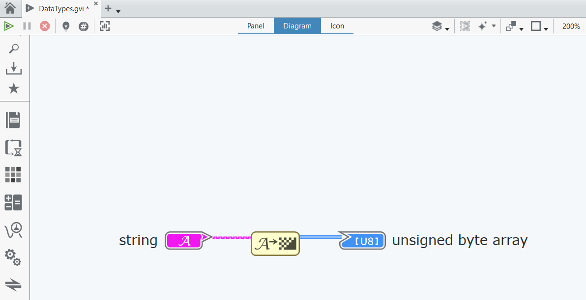

In the `Panel` tab, we can input whatever value we want into the `string` input, and we can see the ASCII values in the corresponding unsigned byte array:

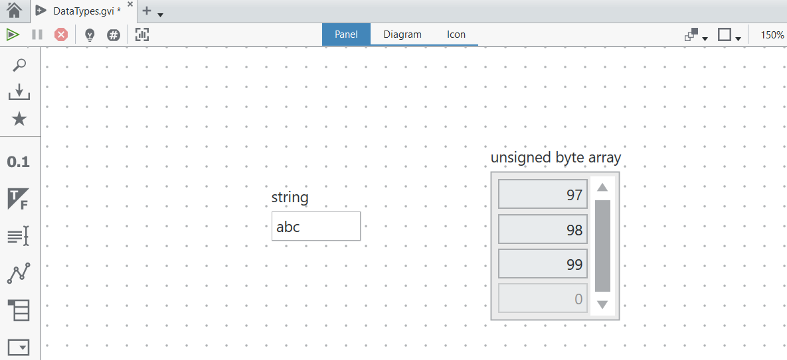

Next, we want to treat each ASCII value as a Fahrenheit temperature, and we want to convert them into Celsius values. We can perform this using the following block:

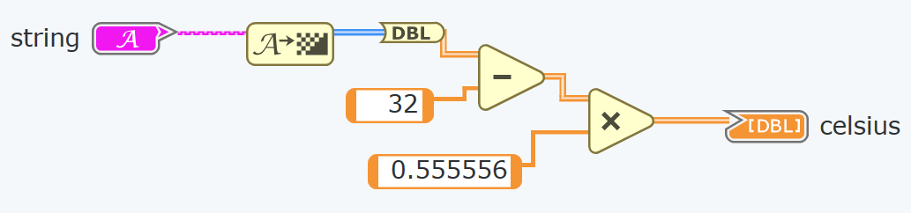

Because `C = (F - 32) * 5/9`, in order to multiply the array by a floating point number, we need to cast it to an array of doubles first. This is done using the `DBL` block, then the array is passed through operators which subtract 32 from the values and scale them by 5/9. **Note: it is important that the constants connected to the subtract / multiply blocks are of type `numerical constant`, to ensure that they are scalars, so that the simulator will perform the operation element-wise. Otherwise, if they are accidentally declared as 1d arrays, it will cause undesired behaviour.**

We can verify its functionality as follows:

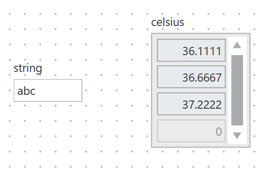

Next, we use the `Add Array Elements` unit and the `Array Size` unit to get the sum and length of the output array respectively, and divide them to obtain the mean.

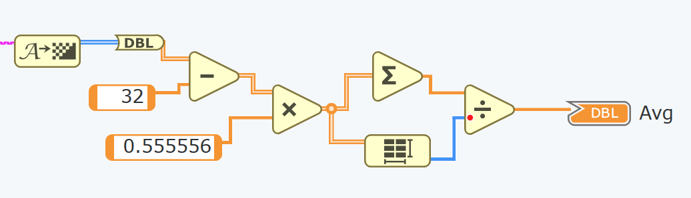

This gives the output as expected:

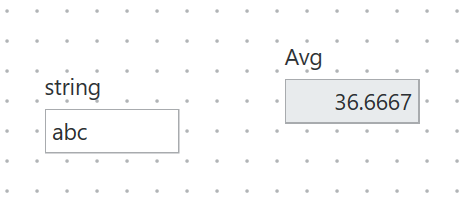

The last step is to compare the value of the mean against a constant threshold, set at 50. It then outputs 1 if the mean is greater than or equal to 50, else 0.

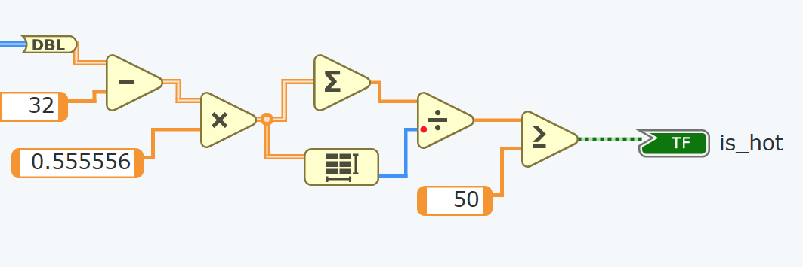

This gives the following outputs:

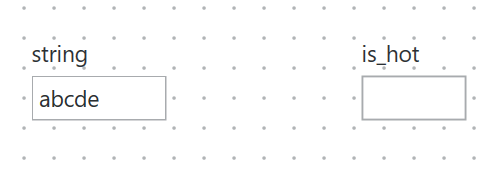

String `abcde` has mean 37.222, hence `is_hot` is false.

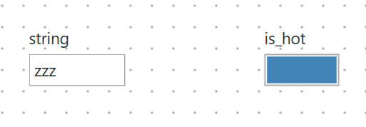

String `zzz` has mean 50. This is becaue `z` has ASCII value 122, hence in Fahrenheit, it is equivalent to `(122-32) * 5/9 = 50`. Hence, `is_hot` is true.

Using surname and first initial as input gives the ASCII values of the characters as follows:

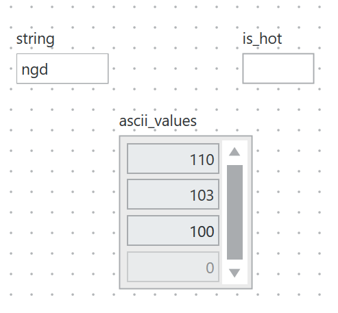

The final schematic is as follows:

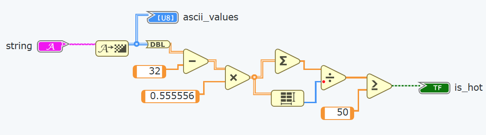

## Exercise 2: Visualisation of CLT

Brief overview: to generate a vector of i.i.d random numbers, evaluate their sample mean, and keep on repeating this in a while loop. On each iteration, update the histogram of sample means so that we can see the distribution of sample means.

We implement the block diagram as follows:

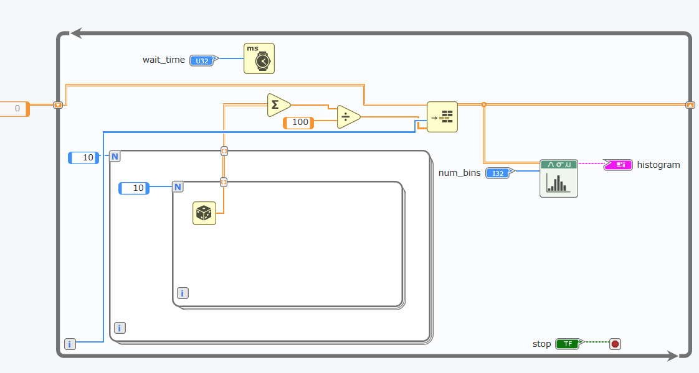

Explanation of block diagram: 

1. We have a while loop. We include a stop flag so that when executing the code, we can click on the flag to terminate execution of the while loop.
2. We have a `Wait` module which basically pauses execution for a fixed number of milliseconds between each iteration of the while loop
3. Inside the while loop, we create two nested for loops which are set to run 10 times each, hence 100 times in total.
4. Within the inner for loop, we insert a `Random Number` unit, and we connect the output of the random number generator to the `Add Array Elements` unit. The tunnels going through the frames of the for loops are set to `auto-index`. Essentially, this means that on each iteration of the loop, the newly-generated random number will be appended to an accumulating array of numbers.
5. We then insert a `Divide` unit, where we divide the running sum by the total number of iterations of the for loops, in this case 100. This is thus the sample mean.
6. We pass this sample mean into the `Insert Into Array` unit, and we pass in the `index` of the while loop as the insertion index. So on iteration 0, we will insert into index 0, then on iteration 1, we will insert into index 1 and so on.
7. We then connect the output array to the right frame of the `while` loop and change it to a `Shift Register`. The `Shift Register` tunnel on the left is then connected as the input array to insert into. Basically, the tunnel on the left carries data from the previous iteration, and the tunnel on the right carries data to the next iteration. This shift register is initialised to an array of zeros.
8. Finally, we add in a histogram unit so that the histogram can be viewed on each iteration.

Running this code, we get the following output. We see that the distribution of sample means looks approximately Gaussian.

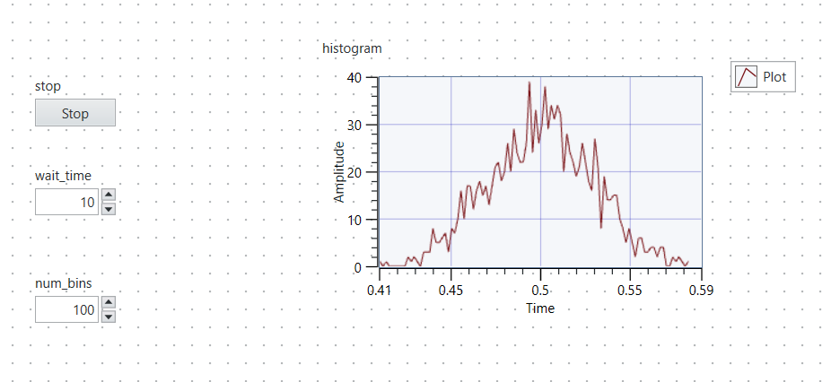

Next, we want to modify the program such that it terminates automatically after 1000 iterations of the while loop. We can do this simply by using a `Greater or Equal` block to compare the index of the while loop with 1000. Once the index reaches 1000 (i.e. the while loop has run 1000 times), the `Greater or Equal` unit outputs true, and hence the while loop terminates.

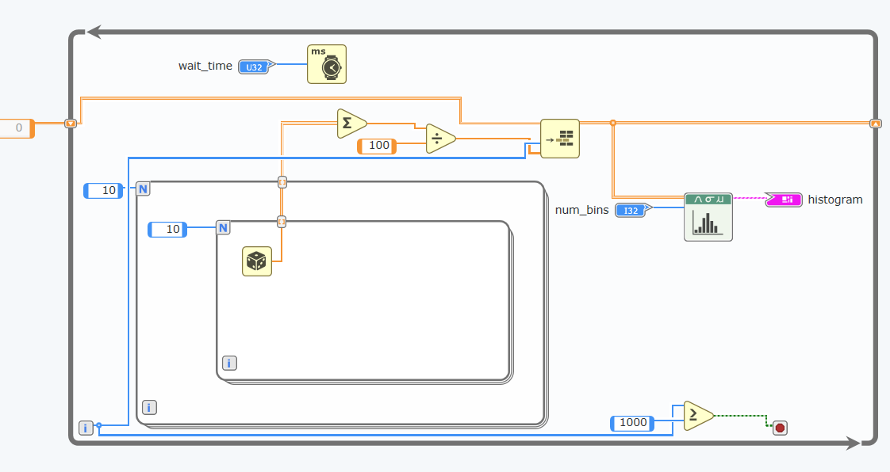

We also reduce the number of bins, hence increasing the width of each bin. This gives the following result:

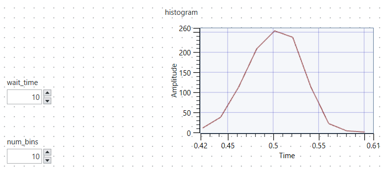

Finally, we want to standardize the distribution, i.e. make it have zero mean and unity standard deviation. We do this as follows:

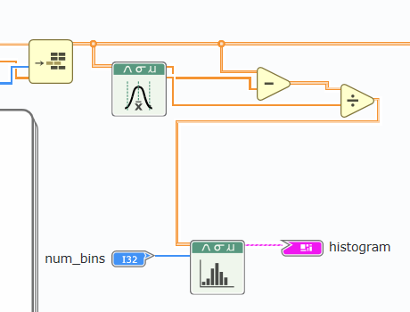

Basically, we take the output of the `Insert into Array` block, which is the array of sample means. We pass this array of sample means into the `Statistics` module, which outputs the mean of the array, and the standard deviation of the array. We then take the array of sample means, subtract the calculated mean from the array (element-wise), and then divide the array by the calculated standard deviation (element-wise). Now that we have the processed array, we then plot this processed array using the `Histogram` function. Note that we still pass the raw array of sample means to the right `Shift Register` tunnel, so that the raw sample means can be carried over to the next iteration.

Hence, the final block diagram is as follows:

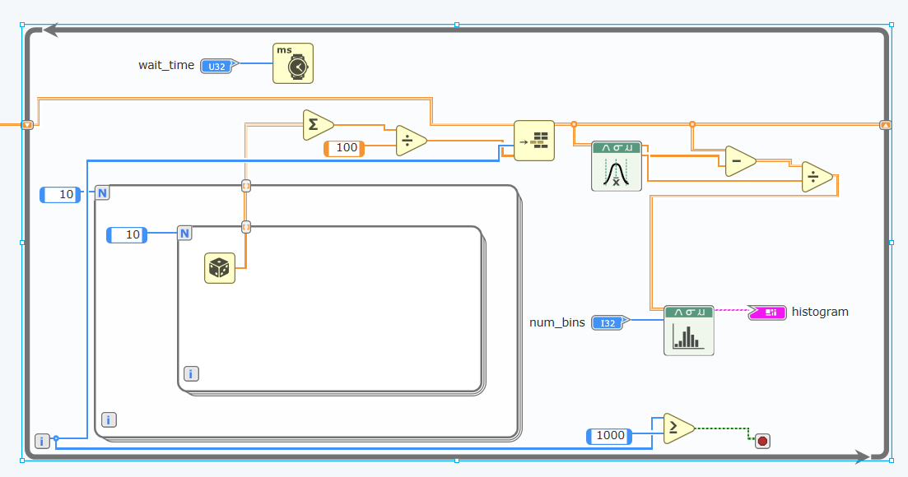

This gives the following output histogram after 1000 iterations. We can see that the distribution has 0 mean and unit variance, as required.

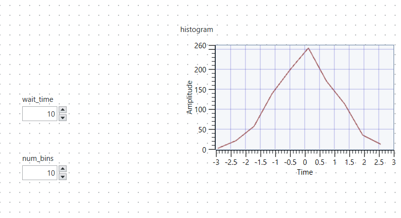