# Lab 1

## Exercise 1: Data Types in Labview

First, we create a `string to byte array` unit, which can take in a string as input, and output a byte array, where each element in the array is the ASCII value of each character in the input string.

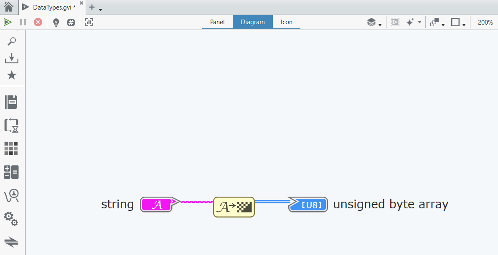

In the `Panel` tab, we can input whatever value we want into the `string` input, and we can see the ASCII values in the corresponding unsigned byte array:

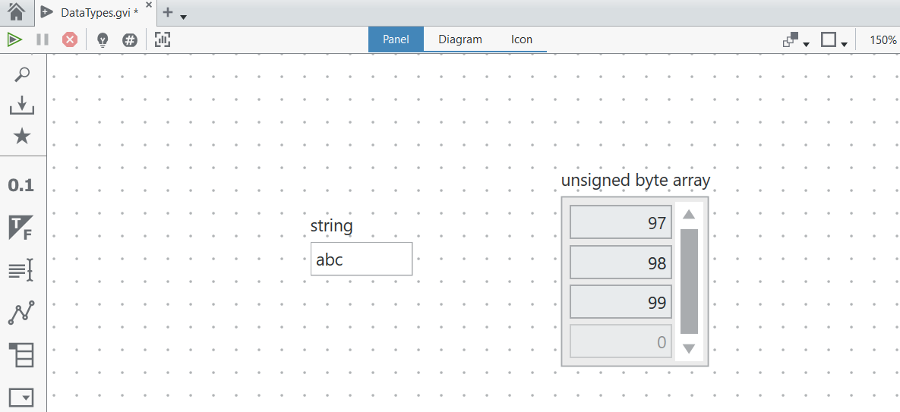

Next, we want to treat each ASCII value as a Fahrenheit temperature, and we want to convert them into Celsius values. We can perform this using the following block:

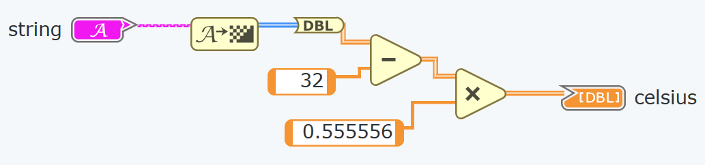

Because `C = (F - 32) * 5/9`, in order to multiply the array by a floating point number, we need to cast it to an array of doubles first. This is done using the `DBL` block, then the array is passed through operators which subtract 32 from the values and scale them by 5/9. **Note: it is important that the constants connected to the subtract / multiply blocks are of type `numerical constant`, to ensure that they are scalars, so that the simulator will perform the operation element-wise. Otherwise, if they are accidentally declared as 1d arrays, it will cause undesired behaviour.**

We can verify its functionality as follows:

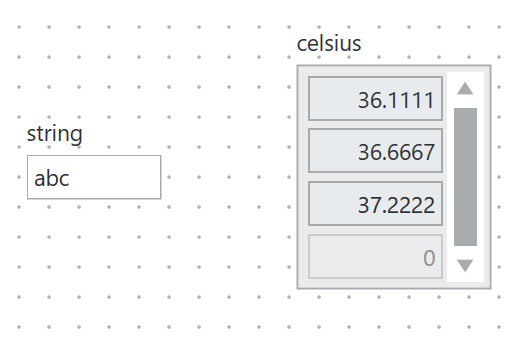

Next, we use the `Add Array Elements` unit and the `Array Size` unit to get the sum and length of the output array respectively, and divide them to obtain the mean.

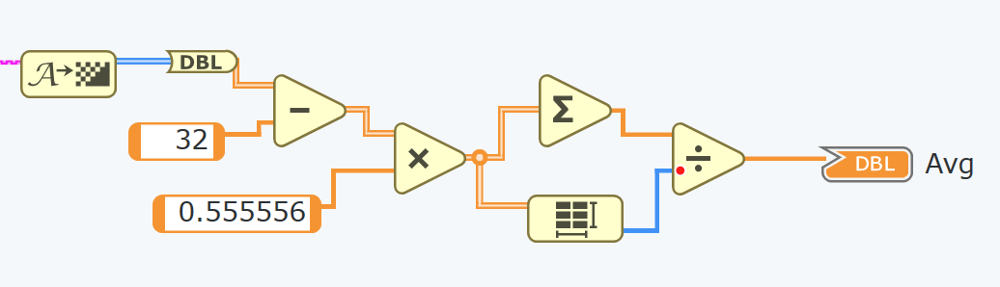

This gives the output as expected:

The last step is to compare the value of the mean against a constant threshold, set at 50. It then outputs 1 if the mean is greater than or equal to 50, else 0.

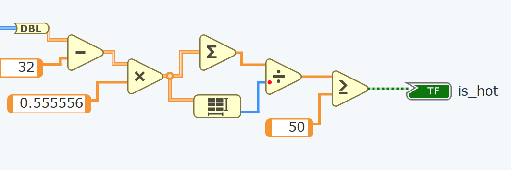

This gives the following outputs:

String `abcde` has mean 37.222, hence `is_hot` is false.

String `zzz` has mean 50. This is becaue `z` has ASCII value 122, hence in Fahrenheit, it is equivalent to `(122-32) * 5/9 = 50`. Hence, `is_hot` is true.

Using surname and first initial as input gives the ASCII values of the characters as follows:

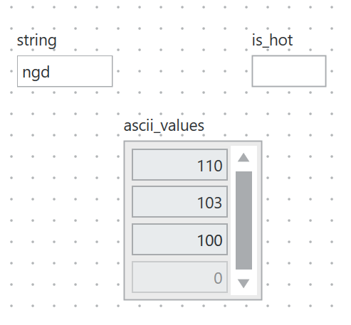

The final schematic is as follows:

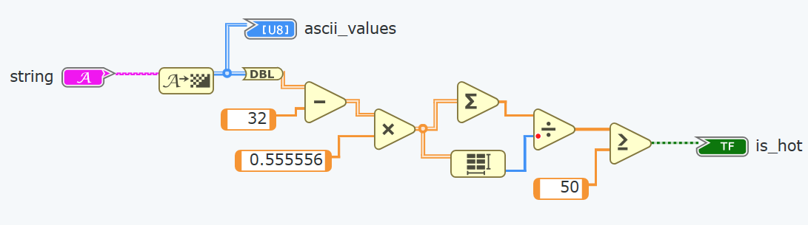

## Exercise 2: Visualisation of CLT

Brief overview: to generate a vector of i.i.d random numbers, evaluate their sample mean, and keep on repeating this in a while loop. On each iteration, update the histogram of sample means so that we can see the distribution of sample means.

We implement the block diagram as follows:

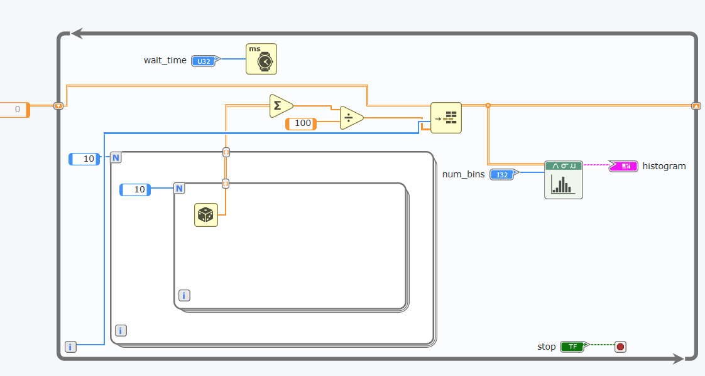

Explanation of block diagram: 

1. We have a while loop. We include a stop flag so that when executing the code, we can click on the flag to terminate execution of the while loop.
2. We have a `Wait` module which basically pauses execution for a fixed number of milliseconds between each iteration of the while loop
3. Inside the while loop, we create two nested for loops which are set to run 10 times each, hence 100 times in total.
4. Within the inner for loop, we insert a `Random Number` unit, and we connect the output of the random number generator to the `Add Array Elements` unit. The tunnels going through the frames of the for loops are set to `auto-index`. Essentially, this means that on each iteration of the loop, the newly-generated random number will be appended to an accumulating array of numbers.
5. We then insert a `Divide` unit, where we divide the running sum by the total number of iterations of the for loops, in this case 100. This is thus the sample mean.
6. We pass this sample mean into the `Insert Into Array` unit, and we pass in the `index` of the while loop as the insertion index. So on iteration 0, we will insert into index 0, then on iteration 1, we will insert into index 1 and so on.
7. We then connect the output array to the right frame of the `while` loop and change it to a `Shift Register`. The `Shift Register` tunnel on the left is then connected as the input array to insert into. Basically, the tunnel on the left carries data from the previous iteration, and the tunnel on the right carries data to the next iteration. This shift register is initialised to an array of zeros.
8. Finally, we add in a histogram unit so that the histogram can be viewed on each iteration.

Running this code, we get the following output. We see that the distribution of sample means looks approximately Gaussian.

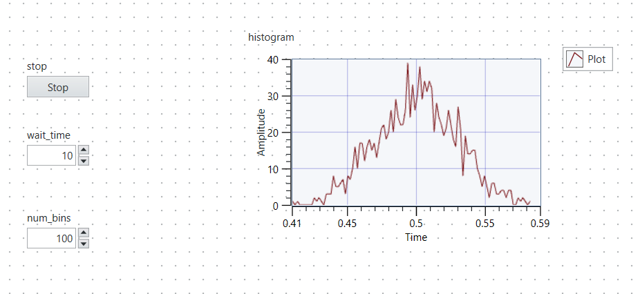

Next, we want to modify the program such that it terminates automatically after 1000 iterations of the while loop. We can do this simply by using a `Greater or Equal` block to compare the index of the while loop with 1000. Once the index reaches 1000 (i.e. the while loop has run 1000 times), the `Greater or Equal` unit outputs true, and hence the while loop terminates.

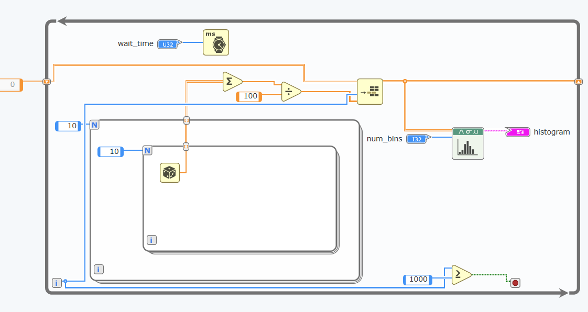

We also reduce the number of bins, hence increasing the width of each bin. This gives the following result:

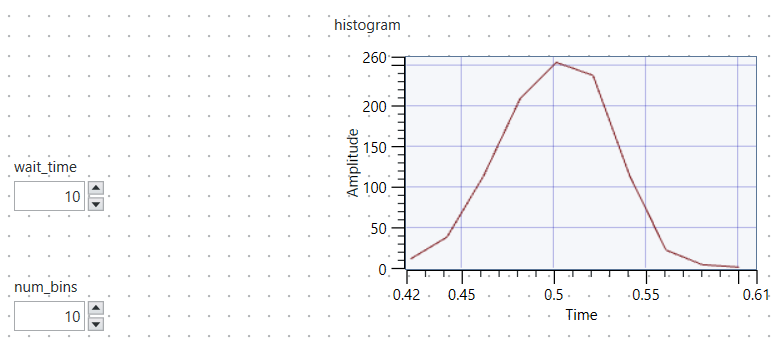

Finally, we want to standardize the distribution, i.e. make it have zero mean and unity standard deviation. We do this as follows:

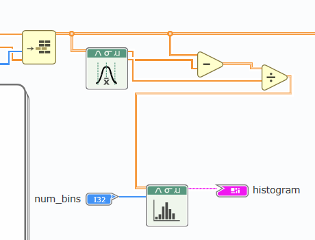

Basically, we take the output of the `Insert into Array` block, which is the array of sample means. We pass this array of sample means into the `Statistics` module, which outputs the mean of the array, and the standard deviation of the array. We then take the array of sample means, subtract the calculated mean from the array (element-wise), and then divide the array by the calculated standard deviation (element-wise). Now that we have the processed array, we then plot this processed array using the `Histogram` function. Note that we still pass the raw array of sample means to the right `Shift Register` tunnel, so that the raw sample means can be carried over to the next iteration.

Hence, the final block diagram is as follows:

This gives the following output histogram after 1000 iterations. We can see that the distribution has 0 mean and unit variance, as required.

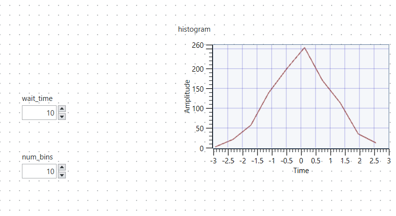

## Exercise 3: AM

First, we create two sine wave generators with the following parameters. Note that the phase angles are 90 degrees to that they become cosine waves.

| Characteristic | Message Signal | Carrier Signal |
|----------------|----------------|----------------|
| Frequency / Hz | 1k | 10k |
| Phase / deg | 90 | 90 |
| Sample rate | 200k | 200k |
| Samples | 1000 | 1000 |

We then insert the `FFT Power Spectrum and PSD` module to generate the PSD of the message signal. The PSD shows the distribution of power over the frequency spectrum.

We then insert graph modules to view the PSD graph, and the carrier and message signals, as follows:

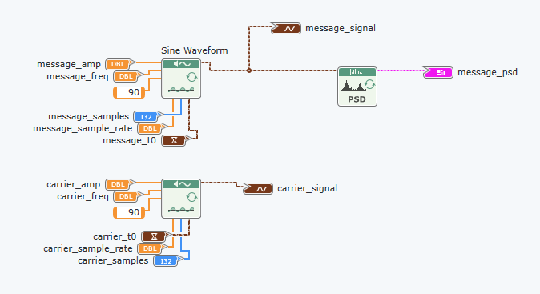
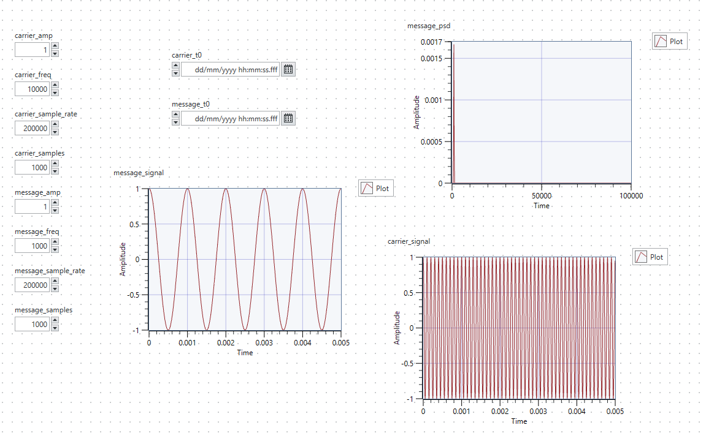

Now we need to generate the full-AM signal. The full-AM signal is given by `s(t) = [A + m(t)]cos(wt)`, where `w` and `A` are the carrier angular frequency and carrier amplitude respectively. Hence, expanding, we have `s(t) = Acos(wt) + m(t)cos(wt) = c(t) + m(t)cos(wt)`, where `c(t)` is the carrier signal. Hence, to obtain the full-AM waveform, we first need to generate a new sinusoidal waveform with the carrier frequency and amplitude 1, i.e. `cos(wt)`, then multiply that with `m(t)`, and add the result together with `c(t)`.

We perform the above operations using the following block diagram:

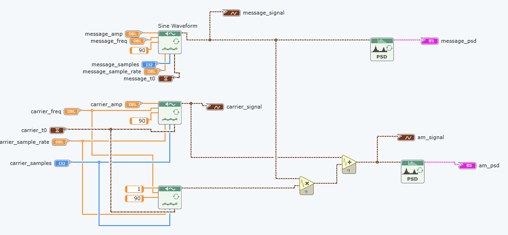
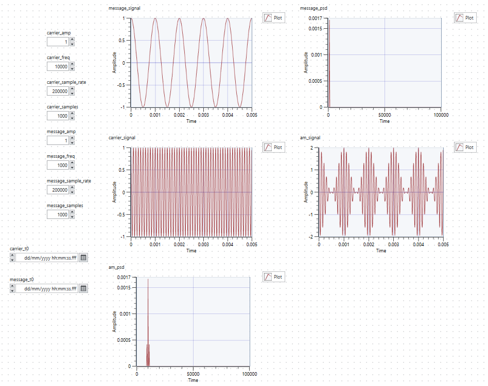

We can see that the PSD of the full-AM waveform has peaks at 10Khz, as well as 9Khz and 11kHz. This is because the message signal `m(t)` has frequency 1kHz, and hence has peaks at `+-1kHz`. Since the carrier signal has frequency 10kHz, when multiplying by a cosine, the spectrum gets shifted by 10kHz, and hence peaks appear at 9kHz and 11kHz. Finally, we also add in the original carrier signal, since `s(t) = c(t) + m(t)cos(wt)`, and the addition of `c(t)` causes another peak at 10kHz.

We can then experiment with `mu = Am / Ac`, i.e. the ratio of the message amplitude to the carrier amplitude. In order to have a valid AM wave, we require mu to be between 0 and 1. This is because `s(t) = [A + m(t)]cos(wt)`, in other words, `[A + m(t)]` is acting as the envelope for `cos(wt)`, hence we must have `[A + m(t)] >= 0` for all t. When `mu < 1`, e.g. if Am = 0.5 and Ac = 1, then we can see that the envelope, `A + m(t)`, will be between 0.5 and 1.5, as follows:

If instead `mu > 1`, e.g. if Am = 1.5 and Ac = 1, we get the following:

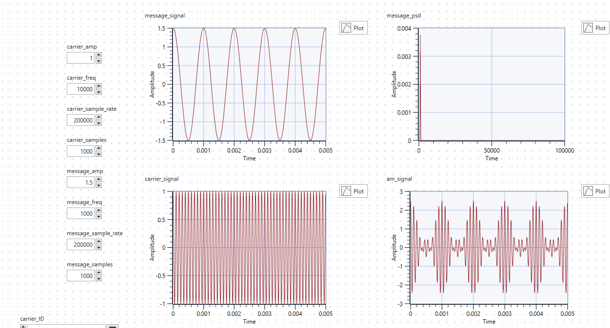

This causes a reflection since the envelope becomes negative.

### Experimenting with Ac and Am

Recall `mu = Am / Ac`. In this section, `Ac` is set to be constant at 2. 

First, we want mu = 0.5, hence Am = 1. Recall `s(t) = [A + m(t)]cos(wt)`. Hence, with Ac = 2 and Am = 1, we expect the envelope to vary between 1 and 3, as follows:

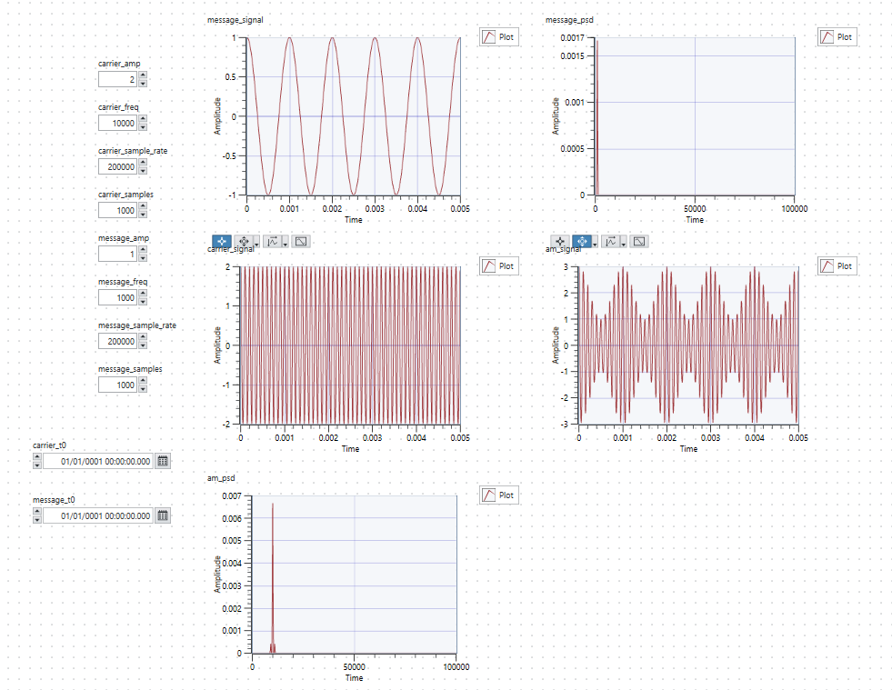

Next, to achieve a mu value of 1, we need Ac = Am = 2. This means that the envelope will vary between 0 and 4, as follows:

Finally, we want a mu value of 1.5 (which is invalid for actual AM modulation). This means we need Am = 3. From `s(t) = [A + m(t)]cos(wt)`, this means that the envelope will vary between -1 and 5. This causes a problem because when the envelope `[A + m(t)]` is multiplied by the `cos(wt)`, multiplication by a negative value will cause inversion, hence the envelope will be reflected in the horizontal axis, as shown:

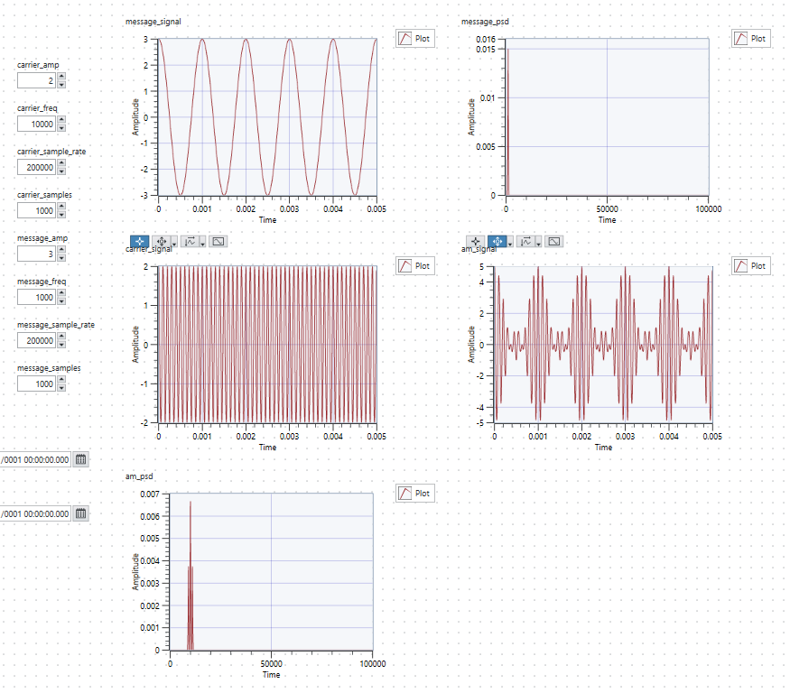

Hence, the impact of the modulation index of the modulated signal is that, when 0 < mu < 1, the envelope is always >= 0. If mu is exactly 1, then the envelope reaches 0, otherwise the envelope is always positive. However if mu is greater than 1, then there are instances where the envelope becomes negative, and multiplying the cosine carrier by a negative term will cause inversion, which is not valid. 

Again, as explained above, the PSD of the modulated signal has peaks at 10kHz, 9kHz and 11kHz. This is because `s(t) = [A + m(t)]cos(wt)`. `m(t)`, the carrier signal, has peaks in the frequency spectrum at 1kHz and -1kHz. When multiplying by a cosine with frequency 10kHz, it gets shifted by 10kHz, hence giving peaks at 9kHz and 11kHz. Finally, since `s(t) = m(t)cos(wt) + Acos(wt)`, the overall spectrum of the full-AM signal has another peak at 10kHz, due to the carrier signal `Acos(wt)`.

In the above graphs, since we keep Ac = 2, the size of the peak at 10kHz (due to `Acos(wt)`) is always the same. And as we increase the value of Am from 1 to 2 to 3, we see the height of the peaks at 9kHz and 11kHz increase.

### Experimenting with frequency

Now we set Ac = 1 and Am = 1, giving mu = 1. We want to vary the message frequency fm to be 1kHz, 2kHz, and 5kHz.

First, with fm = 1kHz, we get the following output:

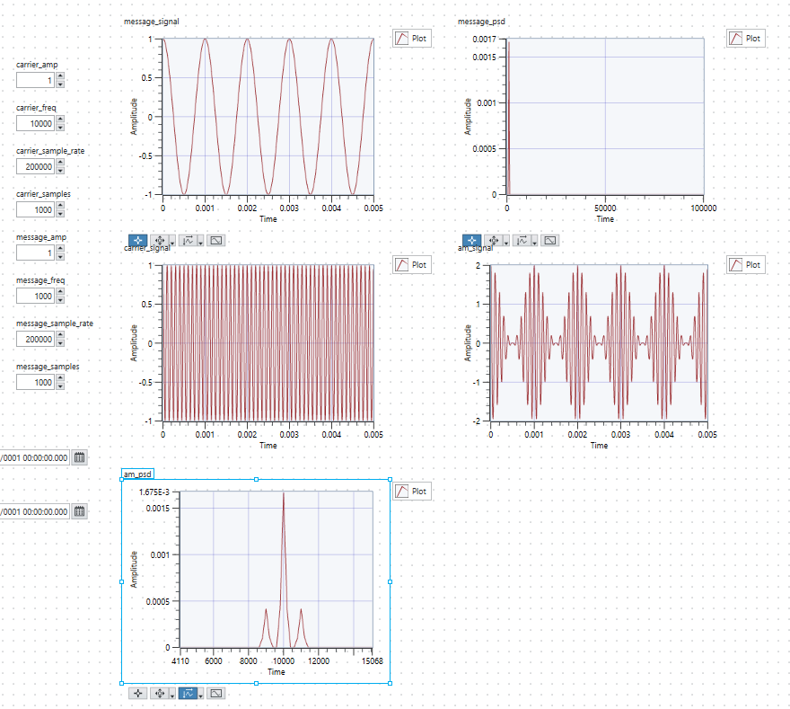

The PSD has peaks at 10kHz, 9kHz and 11kHz, as explained above. Note that although Am and Ac are both 1, i.e. same amplitude, the reason why the peaks are smaller at 9kHz and 11kHz, compared to 10kHz, is because when multiplying by a cos(wt), the frequency spectrum gets shifted by `+w` and `-w`, and another effect is that the peaks are **scaled by a factor of 0.5**.

Next, we set fm = 2kHz:

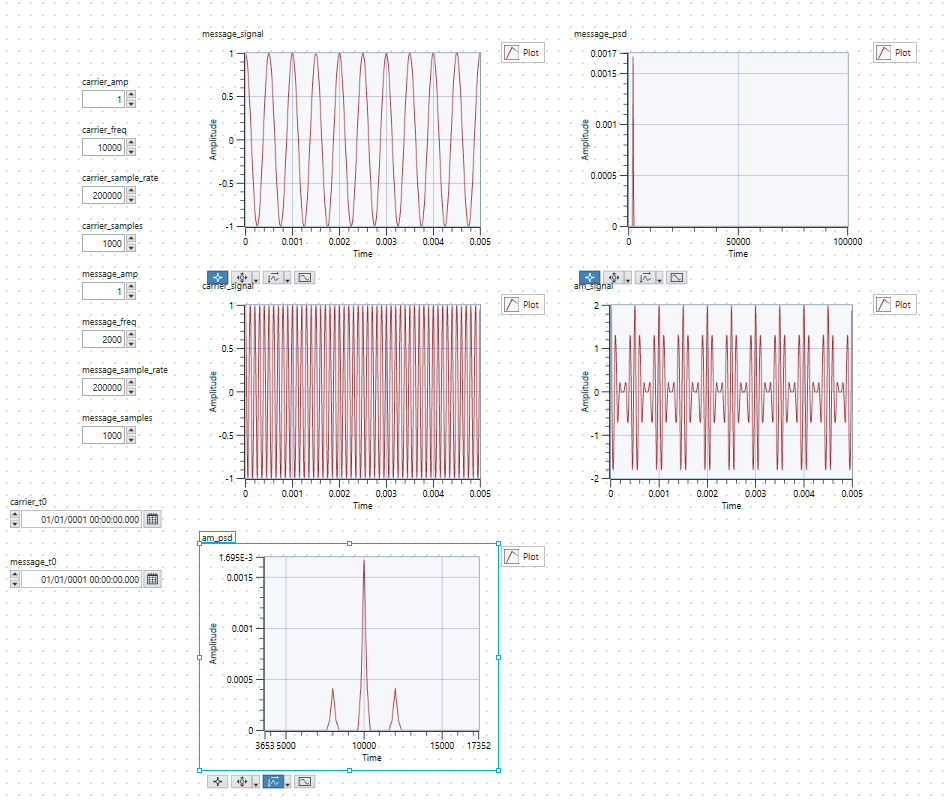

We see two key differences:

1. Firstly, because the envelope is `[A + m(t)]`, since the frequency of `m(t)` is increased, hence the frequency of the envelope is increased.
2. Secondly, we see that the spectrum now has peaks at 10kHz, 8kHz and 12kHz. Again, the peak at 10kHz is due to addition of the carrier signal, `Acos(wt)`. Now, `m(t)` has peaks at 2kHz and -2kHz, hence when multiplied by a cosine of frequency 10kHz, i.e. `m(t)cos(wt)`, the spectrum of `m(t)` gets shifted by 10Khz, hence giving the peaks at 8kHz and 12kHz.

Finally, when changing fm to 5kHz, we see the above differences again:

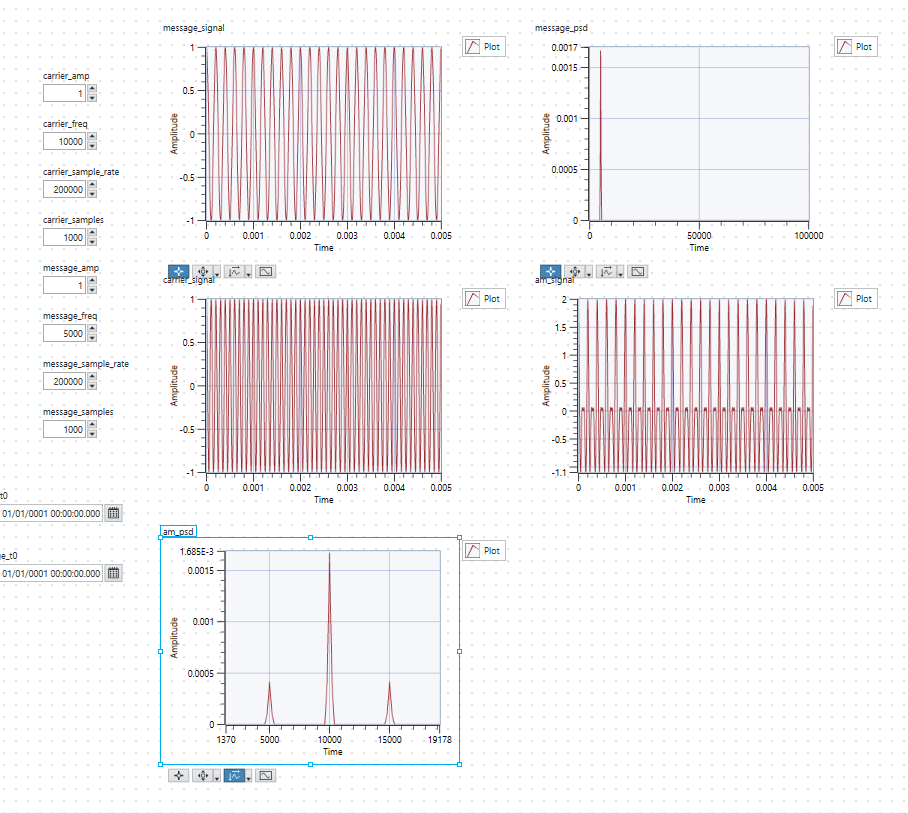

1. Now, the envelope frequency is much higher. The same scale is used so that we can see the difference with fm = 2000 and fm = 1000.
2. Additionally, `m(t)` has peaks at 5kHz and -5kHz, hence when multiplied by a cosine of frequency 10kHz, these peaks get shifted to 5kHz and 15kHz respectively.

Also, one final note is that in the screenshots for the graphs, the graphs for the PSDs are plotted with amplitude against time, instead of amplitude against frequency. This is a trivial matter, because internally, LabView is actually plotting the amplitude against frequency, but when plotting out on the graph, by default it labels the horizontal axis as time instead of frequency. This is just a trivial matter of renaming the axis label from time to frequency.

# Lab 2

Overview: to build AM and FM communication simulators

## Exercise 1a: AM Demodulation (Coherent Demodulation)

Method: the transmitted signal is `s(t) = [A + m(t)]cos(wt)`. We multiply this signal by the carrier signal, `cos(wt)`, and then perform a lowpass filter. How this works is as follows:

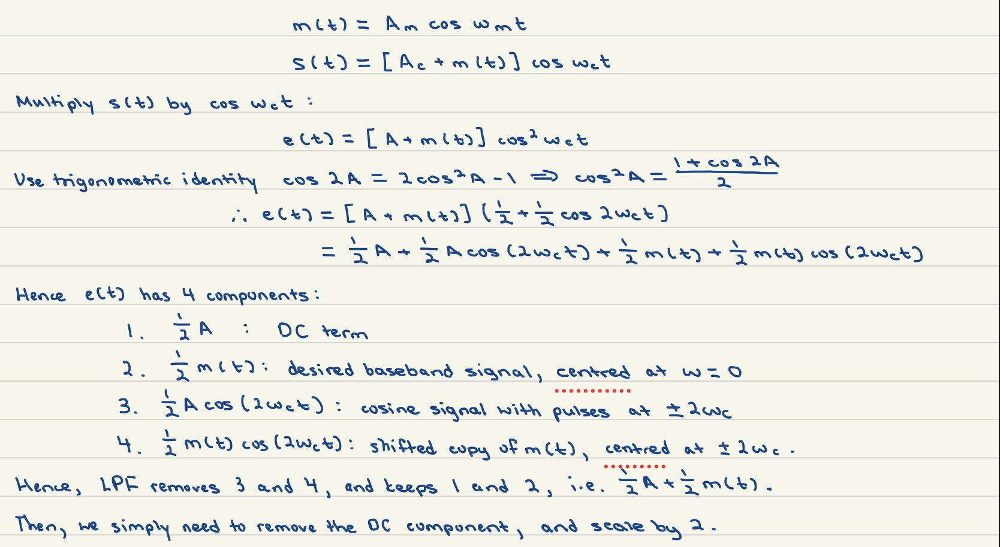

Some things to note about this method:

1. In practice, this method is not very feasible because when we multiply `s(t)` by the carrier, the carrier `cos(wt)` at the receiver must be perfectly synchronized in frequency and phase as the transmitted carrier, which is difficult to achieve in practice.
2. The low-pass filter must have a cutoff frequency high enough to pass the bandwidth of `m(t)`, but low enough to block the components at `2wc`.

We first create the block to perform multiplication of the AM signal and the carrier signal:

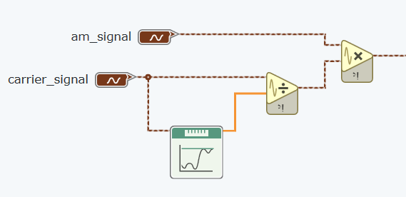

The inputs `am_signal` and `carrier_signal` are of type `Waveform Array Terminal`, which we set `Change to Scalar`. Basically, these inputs store a single waveform, and each waveform contains three attributes

1. t0: the starting time of the waveform
2. dt: the sampling interval
3. Y: the array of sampled data points

The function `Change to Scalar` just means that each input stores a single waveform, whereas the default behaviour is that each input can store an array of waveforms.

Additionally, instead of multiplying the `am_signal` and `carrier_signal` directly, we first use the `Amplitude Measurement` tool to get the amplitude of the `carrier_signal`. Then, we divide the `carrier_signal` by its amplitude first, before we multiply it with `am_signal`. The reason for doing so is because we want to multiply the modulated signal `s(t)` by `cos(wt)`, however the `carrier_signal` is `Acos(wt)`. Hence, we need to normalize its amplitude to make it 1 before we multiply by `am_signal`.

The next step is to pass the multiplied signal, `e(t)`, through a low-pass filter. We use a **lowpass Butterworth filter**, as follows:

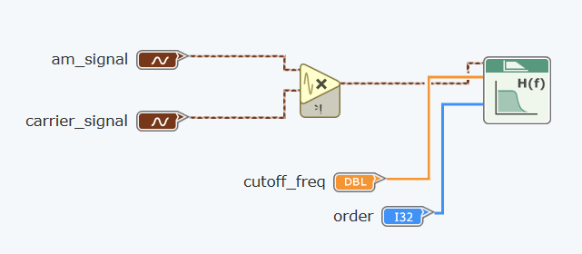

With reference to the screenshot of handwritten notes above, after LPF, the next step is to remove the DC component, then the final step is to scale the signal by factor 2. To remove the DC component, we use the `Amplitude Measurement` block and configure it to `AC DC and RMS` and `Single Shot` mode. Basically, this configuration instructs the module to calculate 3 values:

1. DC component: the mean value of the signal over the measurement window
2. AC component: the RMS value of the AC portion of the signal after subtracting the DC component
3. RMS: the overall RMS value which includes both the AC and DC components

Single Shot mode means that the module performs these calculations only once, i.e. no continuous updating, which is appropriate for our case. Again with reference to the screenshot of handwritten notes above, after removing the DC component, we just need to scale the wave by factor 2. Hence, the final block diagram is as follows:

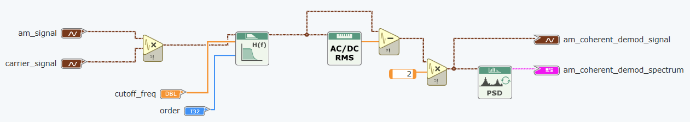

To answer the 3 questions in the specified task, refer to the handwritten notes. In brief:

1. Why use a lowpass filter? To get rid of the high-frequency components at `2wc`
2. Why get rid of the DC component? Because after lowpass filtering, we have `0.5A + 0.5m(t)`
3. Why scale the message amplitude? Because after subtracting DC component, we are left with `0.5m(t)`, hence scale by factor 2.

## Exercise 1b: AM Demodulation (Envelope Detection)

This method involves a half-wave rectifier followed by an RC filter. In practice, the half-wave rectifier is typically implemented using a diode, which conducts during the positive cycles and is zero during the negative cycles:

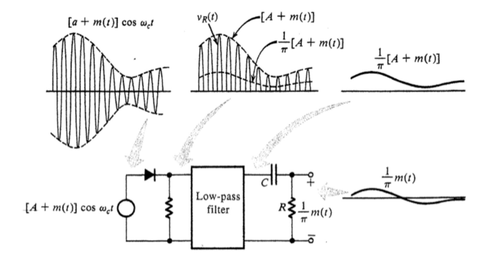

The half-wave rectification using a diode scales the input signal by a factor of 1/pi. The reason for this is as follows:

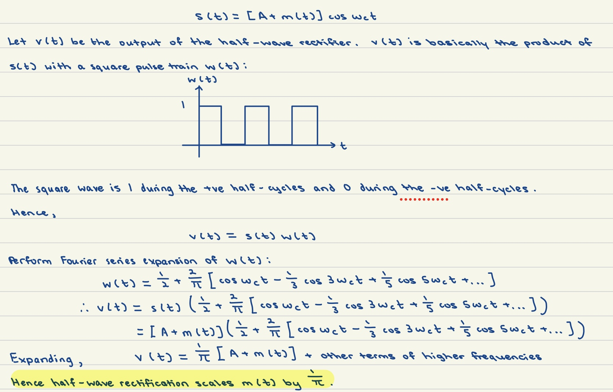

The above explains why half-wave rectification introduces a scaling of 1/pi. Hence, before we do anything, we need to first multiply the signal by pi to account for this loss.

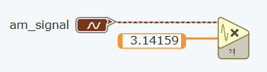

Again, the `am_signal` input is of type `Waveform Array Terminal`. As explained in `Exercise 1a`, the waveform array terminal has 3 attributes: `Y`, `dt` and `t0`. See section `Exercise 1a` for details. To implement the rectifier, we simply need to process the values in the `Y` array by leaving the positive values unchanged and setting the negative values to 0. Hence we use the `Waveform Properties` block to extract the 3 attributes of the amplified wave, `Y`, `dt` and `t0`, so that we can work on the `Y` array. Afterwards, we simply need to combine the modified `Y` array with the `t0` and `dt` to construct back the rectified waveform.

We perform the half-wave rectification using the following block:

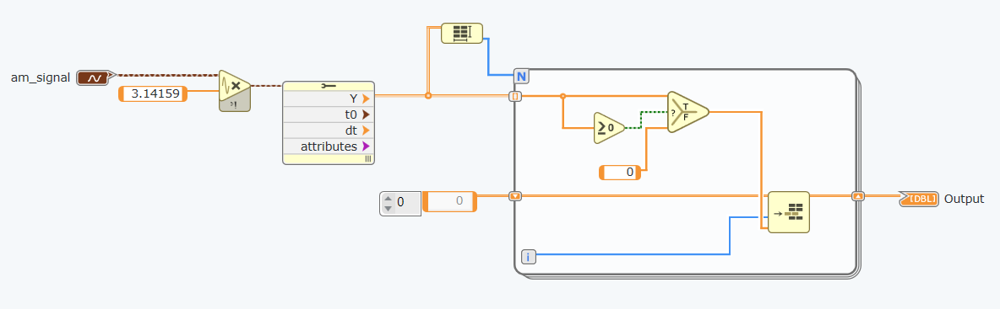

- We create a `For loop`. The number of iterations of the for loop is the length of the array.
- We connect the array `Y` directly to the left-hand side of the `For loop`, and we set this boundary to `Auto Index`. This simply means that on each iteration of the for loop, we will access the next element in the array. So on iteration 0, we access Y[0], on iteration 1, we access Y[1] and so on. This allows us to easily access each element of the array in each iteration of the loop.
- We then use a `SELECT` block which basically acts as a 2-input multiplexer. We give it a condition, which is the boolean expression `Y[i] >= 0`. Hence, if the current element in the array is >= 0, the `SELECT` block will output the element, unchanged. Whereas if the current element is negative, the `SELECT` block will output 0.
- Once we have the output of the `SELECT` block, we pass it into the `INSERT INTO ARRAY` block, so that we can construct the updated array. This `INSERT INTO ARRAY` block works with a shift register (see Lab 1 Exercise 2 for details). Basically, the shift register is connected to the left and right-hand sides of the `For loop`. This passes the accumulating array into the next iteration. Note that on the left-hand side, we connect a constant array of 0s which simply means that we initialise it to 0.
- Once the `For loop` terminates, we can access the final output.

Refer to the below to show that the half-wave rectifier is working as expected. We initialise the `Y` array in the waveform to some random values `[1, 2, -3, -4]` for example purposes. We then pass this waveform through amplification by pi, and then the half-wave rectifier. As such, the output becomes `[pi, 2pi, 0, 0]` as expected.

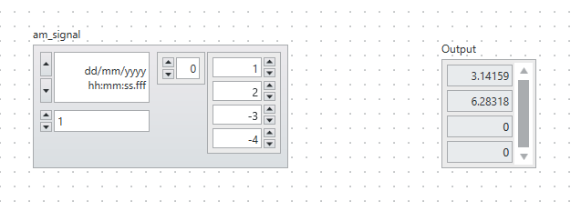

Finally, we use the `Build Waveform` function to combine the modified `Y` array back together with the original `t0` and `dt` values. Then, with reference to the handwritten notes above, we need to use a lowpass filter to remove the terms of higher frequencies, and we need to subtract the DC component to get back the original `m(t)`. We do this using the same blocks as in `Exercise 1a`. Thus, the final block diagram is as follows:

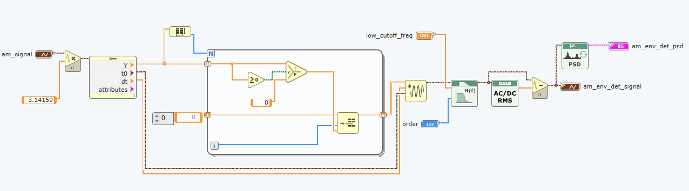

## Exercise 2: AM Simulation

Objective: to observe the entire process of AM modulation and demodulation

We integrate the previous modules, `AM.gvi`, `AMCoherent.gvi` and `AMEnvelopeDet.gvi` into the top-level module `AMTopLevel.gvi`. We connect them as follows:

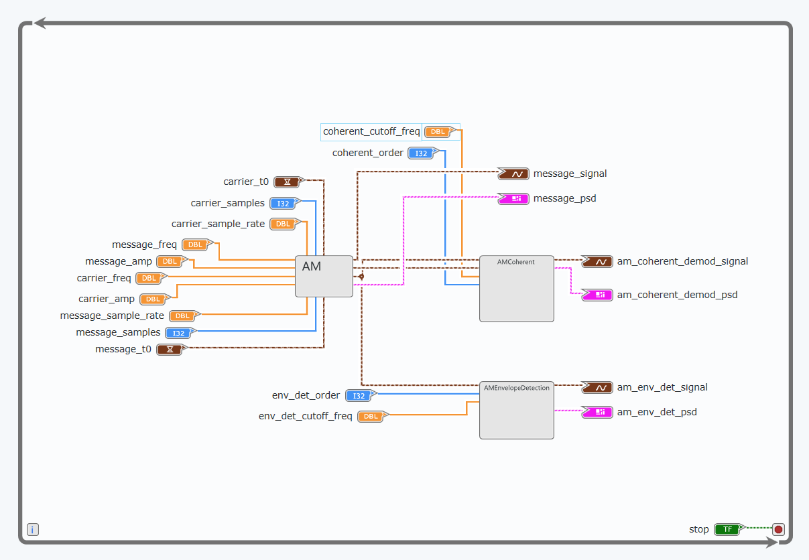

We set the inputs to the following:

| Parameter | Value |
|-----------|-------|
| Carrier Amplitude | 2 |
| Message Amplitude | 1, 2, 3, 4 |
| Sample Frequency | 200kHz |
| Num Samples | 1000 |
| Butterworth Order | 5 |
| Butterworth Cut-off Frequency | 3kHz |
| Carrier Frequency | 10kHz |
| Message Frequency | 1kHz | 

Note that a cutoff frequency of 3kHz is used because `m(t)` has frequency 1kHz, and we want the message signal to be within the passband. Since the carrier frequency is 10kHz, having a cutoff frequency of 3kHz will be able to effectively attenuate the higher-order components.

With message amplitude 1, we observe the following output:

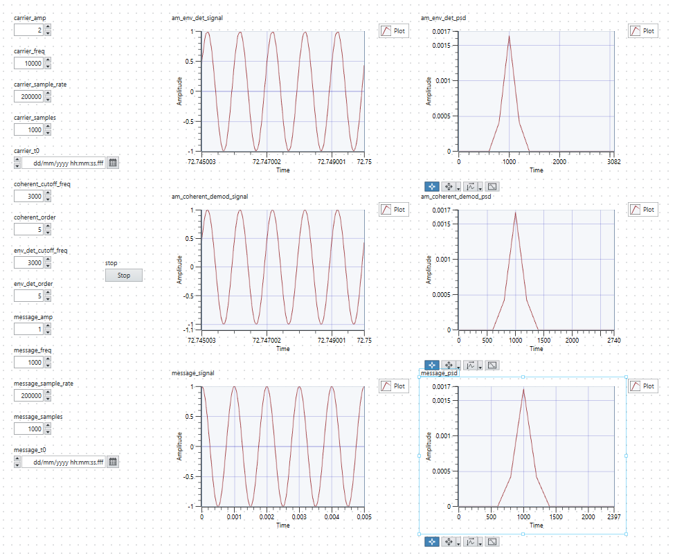

As expected, the demodulated signals both have amplitude 1, and their frequency spectra both show a peak at 1kHz, as expected since `m(t)` is a sinusoid of 1kHz frequency. Note that the reason why there is a phase shift for the demodulated signals (i.e. they are not purely cosine waves where they start at the peak) is simply because the frequency response of the Butterworth filters introduces a phase shift.

With message amplitude 2, we observe the following output:

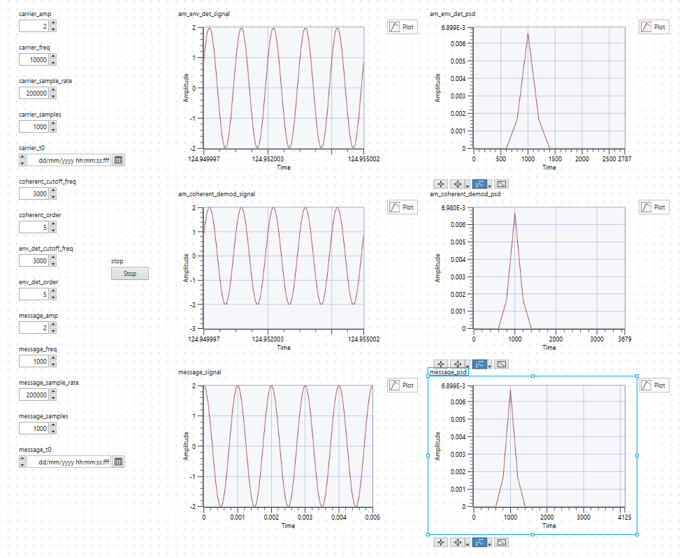

Again, there is no noticeable difference. We see an amplitude of 2 in the time domain, and a peak at 1kHz in the frequency domain, as expected.

With message amplitude 3, we observe the following output:

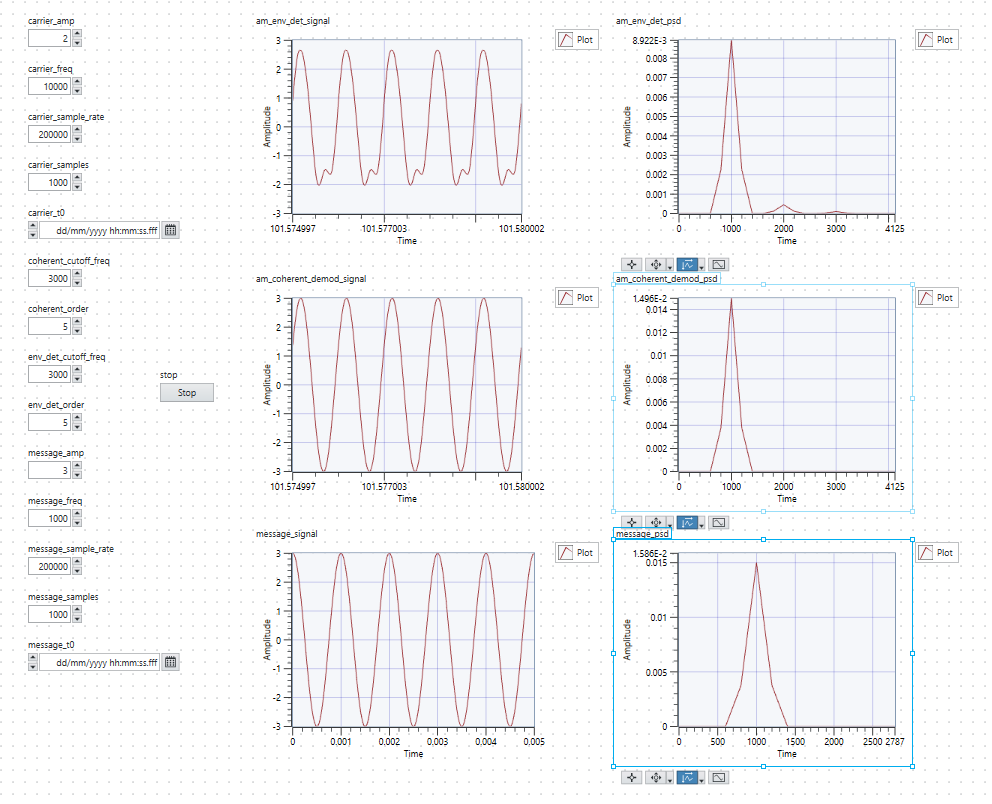

We see there is a distortion with the envelope detector method. Similarly, with message amplitude 4:

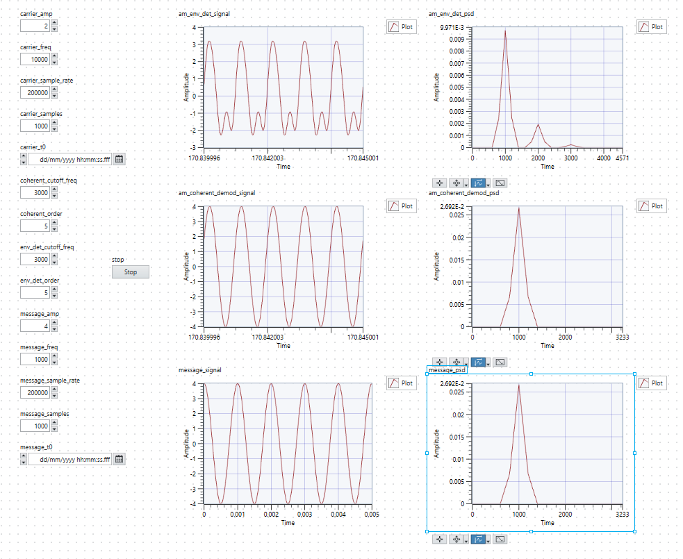

In both cases, we see a distortion in the time domain, as well as additional undesired peaks in the frequency domain. The reason for this is simply because, as explained in `Lab 1 Exercise 3`, the modulation index, `mu = Am / Ac`, has exceeded 1, because in both cases, Am = 3 and Am = 4, the values of mu are 1.5 and 2 respectively. 

Recall `s(t) = [A + m(t)]cos(wt)`. In order for envelope detection to work correctly, the envelope, `A + m(t)`, must always be >= 0. In the last 2 cases where Am > Ac, this rule is violated. For example when Am = 3 and Ac = 2, `A + m(t)` varies between -1 to 5. This causes a problem because when `A + m(t)` is multiplied by `cos(wt)`, if `A + m(t)` is negative, it will cause the modulated signal to be inverted, causing envelope inversion. As such, rectification no longer works correctly, because the negative parts have been inverted to become positive. The rectifier assumes that the positive cycles represent the envelope. However, due to the inversion, the envelope alternates between positive and negative, so this is no longer true, leading to distortion.

Additionally, we also see that in the case of overmodulation, there are additional spectral peaks at 2kHz and 3kHz. These arise because the envelope inversion causes abrupt changes in the demodulated signal, and these abrupt changes introduce additional higher-frequency components. We see in the time-domain, the demodulated signal is no longer a pure sinusoid, but rather the envelope inversion has introduced some additional higher-frequency oscillations. Hence when we do the Fourier series expansion of the demodulated signal, we not only see the peak at 1kHz, because it is no longer a pure sinusoid. We also see the additional peaks at the harmonics 2kHz and 3kHz.

> Aside: slightly longer explanation. Recall that by Fourier theory, any periodic signal can be expressed as a sum of sinusoids of the fundamental frequency, and the harmonics. For a pure sinusoidal waveform, only the fundamental frequency exists. However, in the last two cases above, because the distorted waveforms are no longer purely sinusoid (although they are still periodic), their Fourier series expansions now include the fundamental, as well as the harmonics. Note that harmonics above 3kHz do not exist because the cutoff frequency of the Butterworth filter has attenuated frequencies above 3kHz.

The envelope inversion can be visualised and explained using the following diagram:

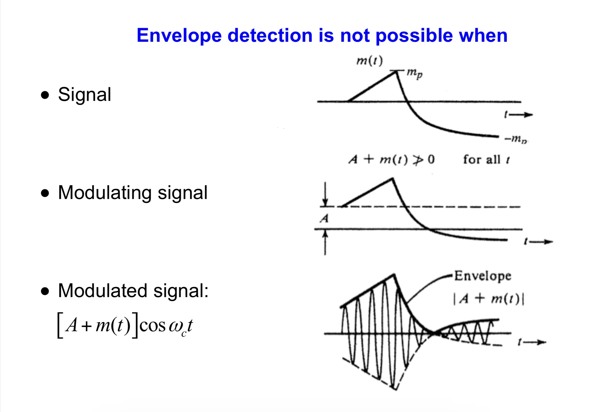

Note that, as can be seen in the graph outputs, overmodulation does not affect coherent detection. Going back to `Lab 2 Exercise 1a`, with reference to the handwritten notes, coherent detection directly extracts `m(t)` even when overmodulation occurs, and there is no dependence on the envelope.

## Exercise 3: USRP

Overview: to use the built-in USRP modules to transmit and receive AM signals.

First we look at the block diagram for the `USRP_AM_TX` module.

We first pass in the device name into the `niUSRP Open TX Session` unit. This basically creates a session handle, and tells the module the name of the device we are using, in this case `NI2900`.

Then, we then use the `niUSRP Configure Signal` unit. This is used to set the parameters. We pass in `IQ Rate`, `carrier frequency`, `gain`, and `active antenna`. 
- `IQ Rate`: the sample rate, i.e. tells the USRP how many samples per second to process. This basically needs to match the sampling rate of the sine generator. So e.g. if the sine generator generates 500k samples per second, then similarly the USRP needs to process 500k samples per second. If there is a mismatch, it may lead to distortion or aliasing.
- `Carrier Frequency`: the center frequency of the RF signal being transmitted or received. The baseband IQ signal will be modulated on this carrier frequency before transmission.
- `Gain`: amplification applied to the signal
- `Active Antenna`: the USRP port being used

The coerced values are the actual values being used by the USRP device, in the event that the values we want to set exceed the capabilities of the USRP device.

Next, we observe the generator block of the transmitter:

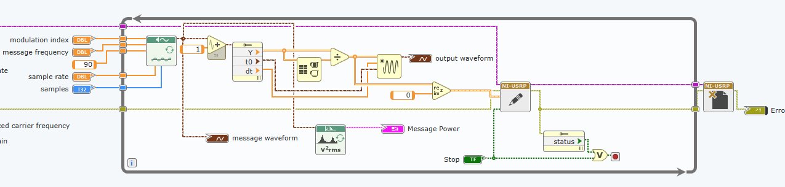

The first component is a sine generator. We pass in the `modulation_index` as the amplitude, which we set to 1. Then we pass in the `message_frequency`, and a constant phase of 90 so that the wave is a cosine wave instead of sine wave. We also pass in the number of `samples` to generate, as well as the `sampling_rate`. To reiterate, the `sampling_rate` must match the `IQ Rate` of the USRP device.

We then take the generated waveform, and display it in the time-domain as `message_waveform`, and display its power spectrum in the frequency domain as `Message Power`. The component `Power Spectrum for 1 Channel` is used which basically applies the FFT and outputs the power at each frequency. This is similar to the `Power Spectral Density`. The difference is that `Message Power` plots the total power in each frequency bin, whereas `Power Spectral Density` plots the power in each bin, divided by the frequency resolution. Hence, the unit for PSD is `V^2 per Hz` whereas message power just plots `V^2`.

Then, with reference to the block diagram, the transmitter takes the generated cosine signal, and adds 1 to it. Recall that in full-AM, `s(t) = [A + m(t)]cos(wt)`. Adding 1 is used to generate `A + m(t)`. Since we want `modulation_index = 1`, and we pass in `modulation_index` as the signal's amplitude, this means that in `A + m(t)`, we need `A = 1` in order to achieve `modulation_index = 1`, thus we add 1 to the signal.

We then decompose the waveform to get the `Y` values, and perform normalization by dividing each element by the maximum element of the array, so that the waveform varies between 0 and 1 instead of 0 and 2. We then reconstruct the waveform back using the `dt` and `t0` attributes, so that we can view the `output_waveform`.

Then, we see in the block diagram that we generate a complex number, passing in the signal values as the real components, and a constant 0 for the imaginary component. This complex array is then passed into the `niUSRP Write TX Data` module. The reason why we need to pass the signal as a complex array is because the USRP device expects the input to be presented in the form of the `In-Phase (I)` component and the `Quadrature (Q)` component, which corresponds to the real and imaginary parts of the baseband signal. In our case, since we are just transmitting a real cosine signal, we set the Q components to be 0, as shown in the block diagram.

How the `niUSRP Write TX Data` module works is that, it takes in the array of complex numbers as a discrete array, and then generates a continuous-time signal which it transmits. It does this using the following process:

1. It takes in a complex array, where each element in the array contains the real part of the signal, and the imaginary part. In this lab exercise, the imaginary part is set to 0.
2. The complex samples are sent to the USRP device over a host-to-device ethernet connection.
3. Using the `IQ Rate` which was configured earlier, the USRP device will perform Digital-to-Analog conversion to output a continuous-time signal, which is just the cosine wave with frequency equal to the `message_frequency`. Note: it technically outputs two separate signals, one corresponding to the cosine (I) component and one corresponding to the sine (Q) component, just that here, the Q component is 0 since the imaginary parts are 0. 
4. Using the `Carrier Frequency` which was configured earlier, the USRP device will up-convert the continuous-time signal so that it is centred at the carrier frequency instead of 0.
5. Using the `Gain` which was configured earlier, the USRP device will amplify the signal. 

Next, we observe how the `USRP_AM_RX` works:

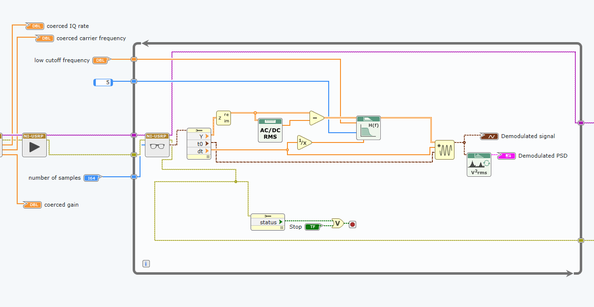

The `niUSRP Initiate` function sends the parameter values to the receiver and gets it running. Then, `niUSRP Fetch Rx Data` fetches the data from the receiver. Internally, the USRP receiver will multiply the received signal together with the sinusoidal carrier, applies a lowpass filter, followed by an ADC, and outputs the digital waveform. This is shown as per the diagram below:

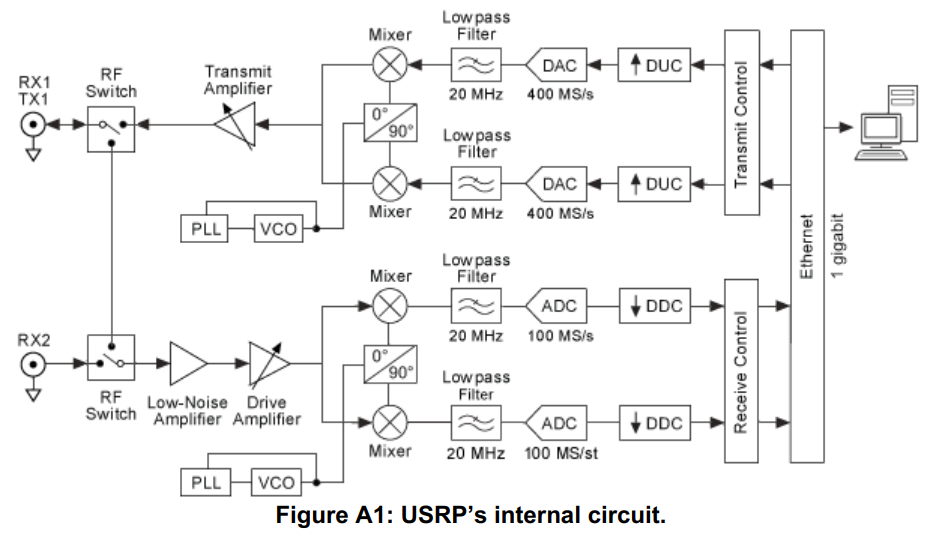

Then, from the digital waveform, the `Y` values are extracted. Only the real parts are of concern, since the imaginary parts are set to 0. Then, the circuit removes the DC component, and applies a lowpass filter to get rid of the high-frequency components. See `Lab 2 Exercise 1a: coherent detection` for the mathematical details. Finally, the `demodulated_signal` and the `demodulated_psd` is shown.

Hence, running the module with `message_frequency = 5kHz` and `modulation_index = 1`, we observe the following output from the transmitter:

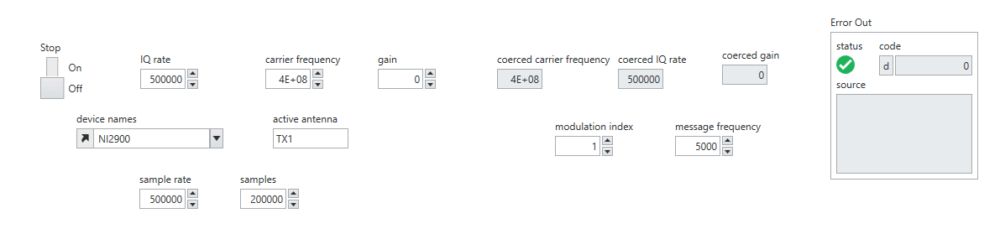
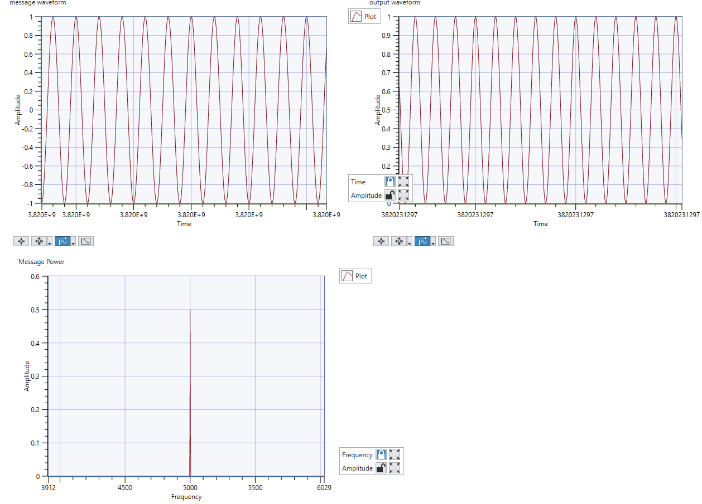

Similarly, the following output on the receiver:

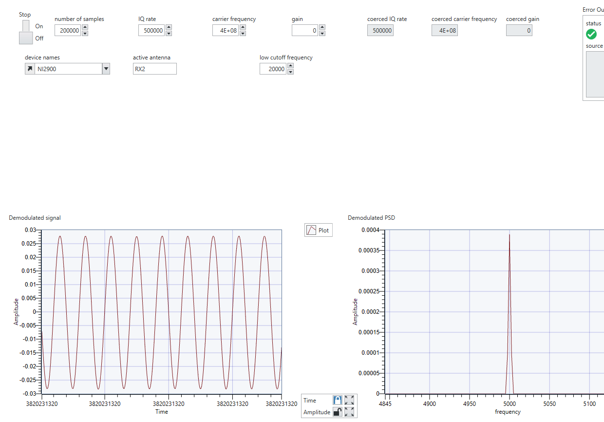

We observe that the demodulated signal on the receiver side has a peak at 5kHz, as expected. Note that the reason why the demodulated signal amplitude is lower than the message amplitude, and the reason why the demodulated signal amplitude is seen to fluctuate slightly, is simply because of factors like attenuation in the channel. For instance, if you cover the antenna with your hand, the amplitude will be changed accordingly.

### Effect of Noise

To observe the effect of noise, we first increase the receiver gain to `20dB`, which means that weaker noise signals will be amplified and detected in addition to the transmitted signal. Then, we gradually reduce the value of `modulation_index` and observe the effect on the output. The table of parameters is as follows:

| Param | Transmitter | Receiver |
|-------|-------------|----------|
| IQ Rate | 500k | 500k |
| Carrier Frequency | 400M | 400M |
| Gain | 0dB | 20dB |
| Sample Rate | 500k | N/A |
| Samples | 200k | 200k |
| LPF Cutoff Frequency | N/A | 1400Hz |
| Modulation Index | Varying | N/A |
| Message Frequency | 1000Hz | N/A |

For `mu = 1`, the transmitter output is as follows:

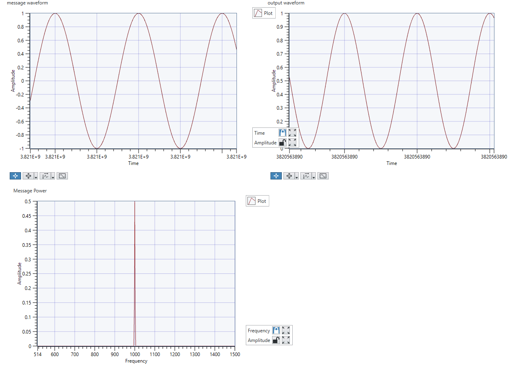

And the receiver demodulates the signal correctly, as follows:

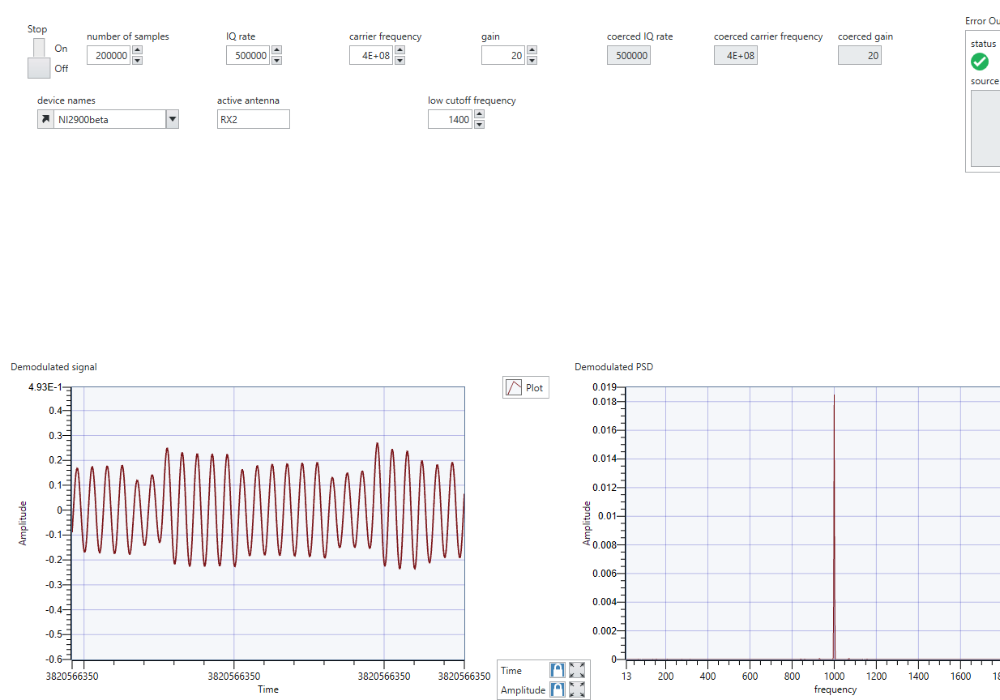

Similarly with `mu = 0.9`:

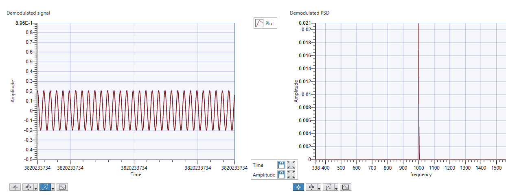

However at `mu = 0.8`, the effects of noise become apparent:

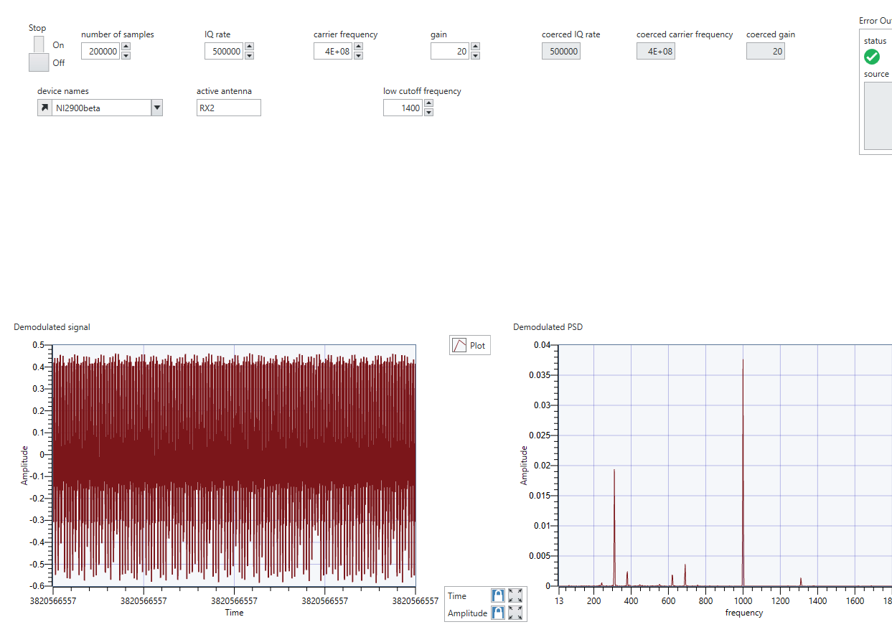

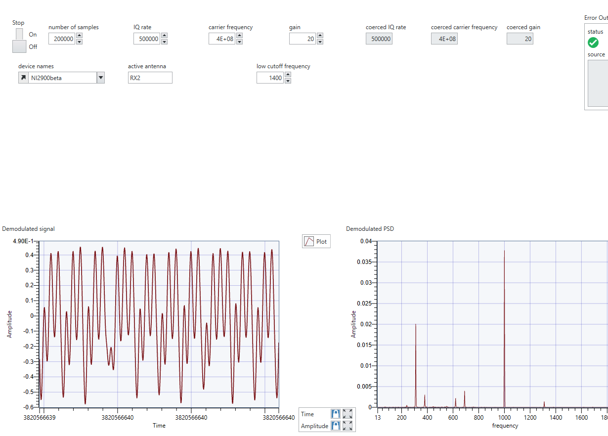

We see the effects of additive noise because the 20dB gain not only amplifies the signal but also amplifies the noise. Hence, we see that the PSD contains a peak at 1kHz, but now it also contains other peaks due to the effects of noise distorting the sinusoidal signal.

Similarly with `mu = 0.7`:

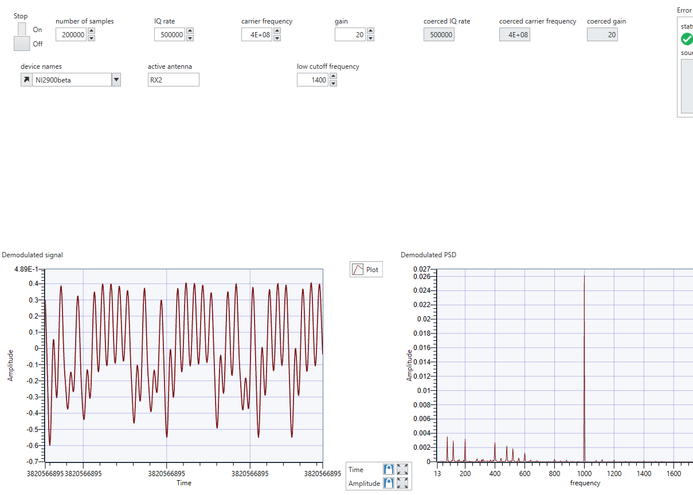

And with `mu = 0.2`:

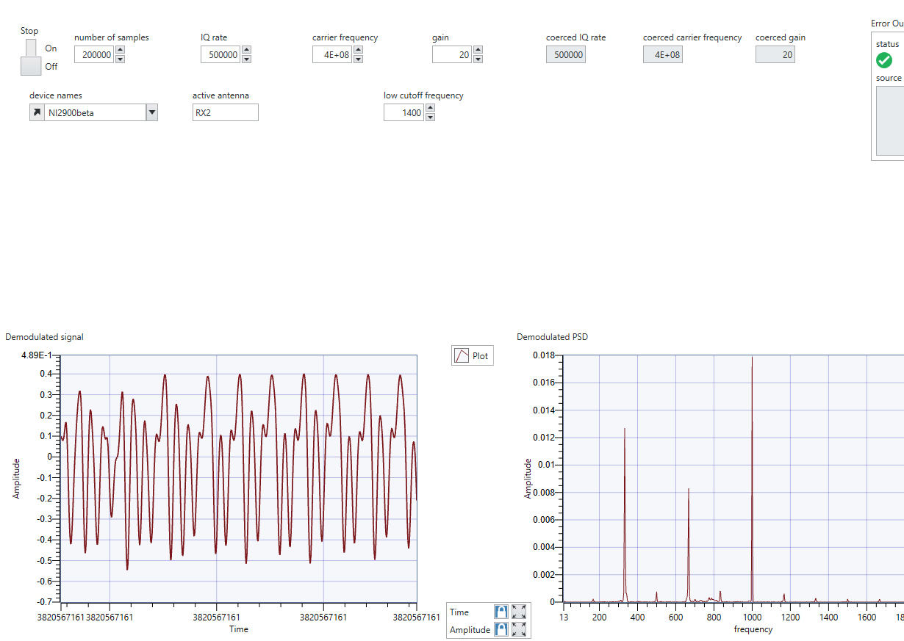

Note: recall how the `USRP_TX_AM` circuit is constructed. It passes in the `modulation_index` as the ampitude of the message signal, adds 1 to it, and divides it by the maximum value. So e.g. for `mu = 1`, after we add 1 to the signal, the range of the signal is `[0, 2]`, and we divide each value by the maximum, hence scaling the waveform to the range `[0, 1]`. Whereas now consider `mu = 0.1`. After we add 1 to the signal, the range of the signal is `[0.9, 1.1]`, and thus when we divide by the maximum value of the array, we end up scaling the waveform to the range `[0.818, 1]`. This can be seen in the following transmitter output with `mu = 0.1`:

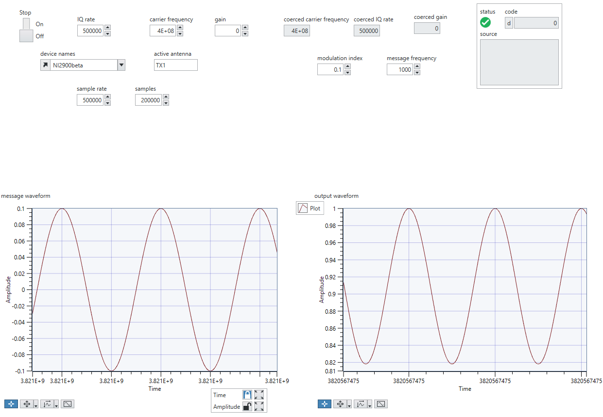

Generally speaking, with a smaller peak-peak amplitude of the signal, the greater the effect of noise. This is because the power of the message signal is smaller relative to the noise, thus the signal-noise ratio decreases.

## Exercise 4: Listening to AM Music

We want to detect a piece of AM-modulated music using the `USRP_AM_Rx_Music.gvi`.  TODO: check how to connect earphones to the PC because there is no sound coming out.

TODO: 
- check purpose of lowpass filter in the USRP internal circuit

# Lab 3

## Exercise 1: FM Modulator

First see the below for some theory on FM:

We construct the FM circuit as follows:

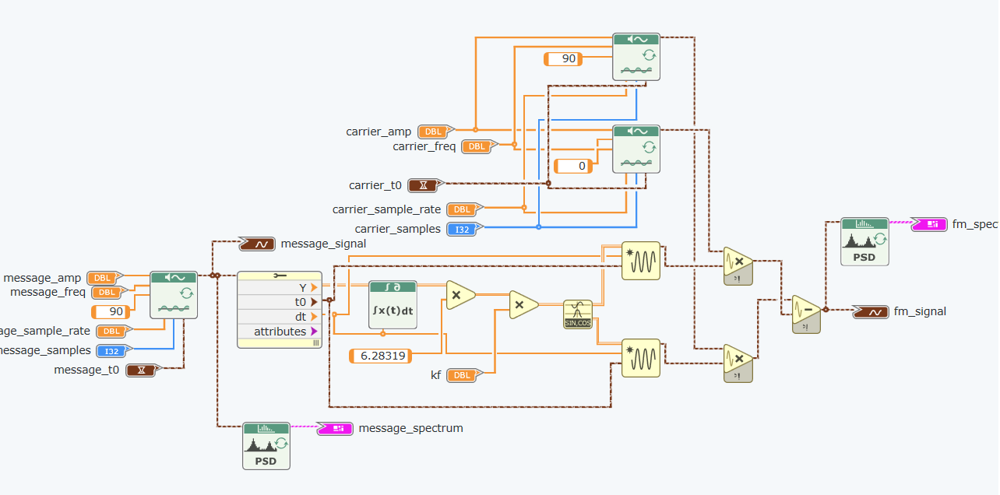

First, we use the wave generator to generate the message signal `m(t)`. Then, the next step is to perform integration to obtain `theta(t)`. The `Integral x(t)` function takes in the values in the array, as well as the `dt` argument. The `dt` argument is important because internally, the `Integral x(t)` function performs numerical integration by multiplying each value in the Y array by `dt` in order to approximate the area under the graph.

The output of the integral is then multiplied by `kf`, and then `2pi`, giving `theta(t)`. We then pass this through the `sine and cosine` function to obtain `sin(theta(t))` and `cos(theta(t))` and construct the waveforms back. We then use another wave generator to generate `Acos(wt)` and `Asin(wt)` where `A = carrier amplitude` and `w = carrier angular frequency`, and multiply them by `cos(theta(t))` and `sin(theta(t))` respectively. Finally we subtract them to obtain the FM output signal as derived above.

We then vary `kf` between 500, 2000, 5000 and observe how the output changes. For `kf = 500`:

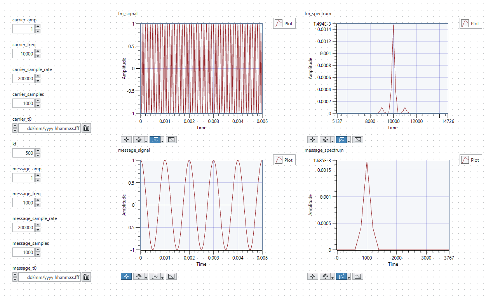

The message frequency is 1kHz, hence the `message_psd` has a peak in the frequency spectrum at 1kHz, as expected. To understand the frequency spectrum of the modulated signal, we need to consider `Bessel functions of the first kind, c.f. Topics in EE - Signals and Communications, Prof Kin K. Leung`. Consider the following:

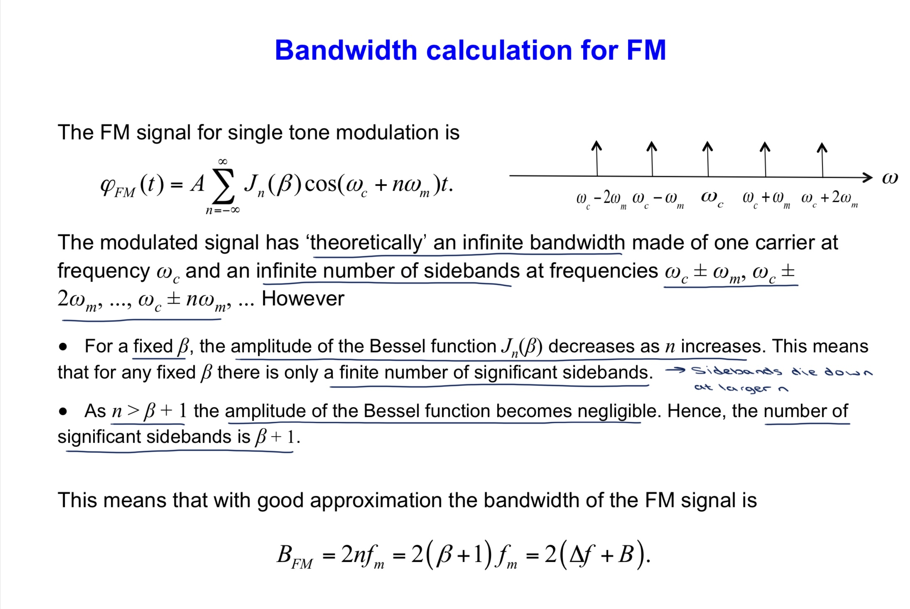

Basically, in FM, the modulated signal has an infinite bandwidth made up of one component at the carrier frequency `fc`, and an infinite number of sidebands at frequencies `fc + fm`, `fc - fm`, `fc + 2fm`, `fc - 2fm`, ... `fc + kfm` where `k` is an integer. The amplitudes of the sidebands are weighted by `J_n(beta)`, where `beta` is the modulation index a.k.a. the frequency deviation ratio. For `kf = 500` and `mp = 1`, we have `delta_f = kf * mp = 500`, and the bandwidth `B = 1000`, since the message frequency is 1. Hence, this gives `beta = delta_f / B = 0.5`. 

For FM, the number of significant sidebands is `beta + 1` because for `n > beta + 1` the amplitude of the Bessel function becomes negligible. Thus, only `n = 1` sideband is significant in this case. This agrees with the PSD screenshot above, where we have 2 significant sidebands at 9kHz and 11kHz, together with the center frequency at 10kHz.

Changing `kf = 2000`, we get the following:

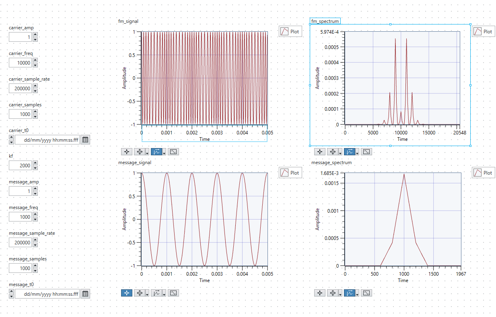

Now, with `kf = 2000`, we have `delta_f = kf * mp = 2000 * 1 = 2000`. Hence, we have `beta = delta_f / B = 2`. Thus, the number of significant sidebands is `beta + 1 = 3`. As expected, we see that there are peaks at the center frequency 10kHz, as well as 3 significant sidebands at 11kHz, 12kHz, 13kHz, and another 3 sidebands mirrored at 9kHz, 8kHz, and 7kHz.

Finally with `kf = 5000`:

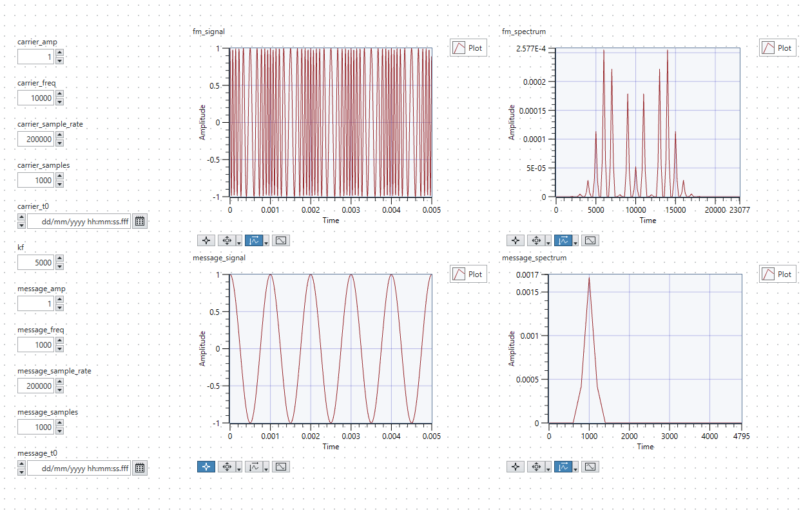

Now, with `kf = 5000`, we have `delta_f = kf * mp = 5000 * 1 = 5000`. Hence, we have `beta = delta_f / B = 5`. Thus, the number of significant sidebands is `beta + 1 = 6`. Hence, we see on the PSD that there are peaks at 10kHz, as well as 6 sidebands on each side separated at intervals of 1kHz. We see an additional 7th sideband, however the amplitude is very small. 

> Key takeaway: in FM, the modulated signal has theoretically an infinite bandwidth made up of one component at the carrier frequency fc, and an infinite number of sidebands at frequencies `fc +- n * fm`. However, for a fixed frequency deviation ratio beta, the amplitude of the bessel functions `J_n(beta)` decreases as n increases. As `n > beta + 1` the amplitude of the Bessel function becomes negligible. Thus the number of significant sidebands is `beta + 1`. Hence the bandwidth of FM signal is approximated using Carson's rule, where `B_fm = 2n * fm = 2(beta + 1) * fm = 2 * (delta_f + B)`.
