# Lab 1

## Exercise 1: Data Types in Labview

First, we create a `string to byte array` unit, which can take in a string as input, and output a byte array, where each element in the array is the ASCII value of each character in the input string.


In the `Panel` tab, we can input whatever value we want into the `string` input, and we can see the ASCII values in the corresponding unsigned byte array:


Next, we want to treat each ASCII value as a Fahrenheit temperature, and we want to convert them into Celsius values. We can perform this using the following block:


Because `C = (F - 32) * 5/9`, in order to multiply the array by a floating point number, we need to cast it to an array of doubles first. This is done using the `DBL` block, then the array is passed through operators which subtract 32 from the values and scale them by 5/9. **Note: it is important that the constants connected to the subtract / multiply blocks are of type `numerical constant`, to ensure that they are scalars, so that the simulator will perform the operation element-wise. Otherwise, if they are accidentally declared as 1d arrays, it will cause undesired behaviour.**

We can verify its functionality as follows:


Next, we use the `Add Array Elements` unit and the `Array Size` unit to get the sum and length of the output array respectively, and divide them to obtain the mean.


This gives the output as expected:


The last step is to compare the value of the mean against a constant threshold, set at 50. It then outputs 1 if the mean is greater than or equal to 50, else 0.


This gives the following outputs:


String `abcde` has mean 37.222, hence `is_hot` is false.


String `zzz` has mean 50. This is becaue `z` has ASCII value 122, hence in Fahrenheit, it is equivalent to `(122-32) * 5/9 = 50`. Hence, `is_hot` is true.

Using surname and first initial as input gives the ASCII values of the characters as follows:


The final schematic is as follows:


## Exercise 2: Visualisation of CLT

Brief overview: to generate a vector of i.i.d random numbers, evaluate their sample mean, and keep on repeating this in a while loop. On each iteration, update the histogram of sample means so that we can see the distribution of sample means.

We implement the block diagram as follows:


Explanation of block diagram: 

1. We have a while loop. We include a stop flag so that when executing the code, we can click on the flag to terminate execution of the while loop.
2. We have a `Wait` module which basically pauses execution for a fixed number of milliseconds between each iteration of the while loop
3. Inside the while loop, we create two nested for loops which are set to run 10 times each, hence 100 times in total.
4. Within the inner for loop, we insert a `Random Number` unit, and we connect the output of the random number generator to the `Add Array Elements` unit. The tunnels going through the frames of the for loops are set to `auto-index`. Essentially, this means that on each iteration of the loop, the newly-generated random number will be appended to an accumulating array of numbers.
5. We then insert a `Divide` unit, where we divide the running sum by the total number of iterations of the for loops, in this case 100. This is thus the sample mean.
6. We pass this sample mean into the `Insert Into Array` unit, and we pass in the `index` of the while loop as the insertion index. So on iteration 0, we will insert into index 0, then on iteration 1, we will insert into index 1 and so on.
7. We then connect the output array to the right frame of the `while` loop and change it to a `Shift Register`. The `Shift Register` tunnel on the left is then connected as the input array to insert into. Basically, the tunnel on the left carries data from the previous iteration, and the tunnel on the right carries data to the next iteration. This shift register is initialised to an array of zeros.
8. Finally, we add in a histogram unit so that the histogram can be viewed on each iteration.

Running this code, we get the following output. We see that the distribution of sample means looks approximately Gaussian.


Next, we want to modify the program such that it terminates automatically after 1000 iterations of the while loop. We can do this simply by using a `Greater or Equal` block to compare the index of the while loop with 1000. Once the index reaches 1000 (i.e. the while loop has run 1000 times), the `Greater or Equal` unit outputs true, and hence the while loop terminates.


We also reduce the number of bins, hence increasing the width of each bin. This gives the following result:


Finally, we want to standardize the distribution, i.e. make it have zero mean and unity standard deviation. We do this as follows:


Basically, we take the output of the `Insert into Array` block, which is the array of sample means. We pass this array of sample means into the `Statistics` module, which outputs the mean of the array, and the standard deviation of the array. We then take the array of sample means, subtract the calculated mean from the array (element-wise), and then divide the array by the calculated standard deviation (element-wise). Now that we have the processed array, we then plot this processed array using the `Histogram` function. Note that we still pass the raw array of sample means to the right `Shift Register` tunnel, so that the raw sample means can be carried over to the next iteration.

Hence, the final block diagram is as follows:


This gives the following output histogram after 1000 iterations. We can see that the distribution has 0 mean and unit variance, as required.


## Exercise 3: AM

First, we create two sine wave generators with the following parameters. Note that the phase angles are 90 degrees to that they become cosine waves.

| Characteristic | Message Signal | Carrier Signal |
|----------------|----------------|----------------|
| Frequency / Hz | 1k | 10k |
| Phase / deg | 90 | 90 |
| Sample rate | 200k | 200k |
| Samples | 1000 | 1000 |

We then insert the `FFT Power Spectrum and PSD` module to generate the PSD of the message signal. The PSD shows the distribution of power over the frequency spectrum.

We then insert graph modules to view the PSD graph, and the carrier and message signals, as follows:


Now we need to generate the full-AM signal. The full-AM signal is given by `s(t) = [A + m(t)]cos(wt)`, where `w` and `A` are the carrier angular frequency and carrier amplitude respectively. Hence, expanding, we have `s(t) = Acos(wt) + m(t)cos(wt) = c(t) + m(t)cos(wt)`, where `c(t)` is the carrier signal. Hence, to obtain the full-AM waveform, we first need to generate a new sinusoidal waveform with the carrier frequency and amplitude 1, i.e. `cos(wt)`, then multiply that with `m(t)`, and add the result together with `c(t)`.

We perform the above operations using the following block diagram:


We can see that the PSD of the full-AM waveform has peaks at 10Khz, as well as 9Khz and 11kHz. This is because the message signal `m(t)` has frequency 1kHz, and hence has peaks at `+-1kHz`. Since the carrier signal has frequency 10kHz, when multiplying by a cosine, the spectrum gets shifted by 10kHz, and hence peaks appear at 9kHz and 11kHz. Finally, we also add in the original carrier signal, since `s(t) = c(t) + m(t)cos(wt)`, and the addition of `c(t)` causes another peak at 10kHz.

We can then experiment with `mu = Am / Ac`, i.e. the ratio of the message amplitude to the carrier amplitude. In order to have a valid AM wave, we require mu to be between 0 and 1. This is because `s(t) = [A + m(t)]cos(wt)`, in other words, `[A + m(t)]` is acting as the envelope for `cos(wt)`, hence we must have `[A + m(t)] >= 0` for all t. When `mu < 1`, e.g. if Am = 0.5 and Ac = 1, then we can see that the envelope, `A + m(t)`, will be between 0.5 and 1.5, as follows:

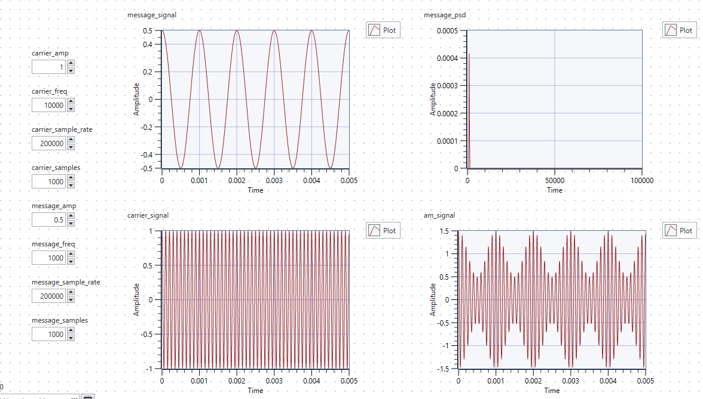

If instead `mu > 1`, e.g. if Am = 1.5 and Ac = 1, we get the following:


This causes a reflection since the envelope becomes negative.

### Experimenting with Ac and Am

Recall `mu = Am / Ac`. In this section, `Ac` is set to be constant at 2. 

First, we want mu = 0.5, hence Am = 1. Recall `s(t) = [A + m(t)]cos(wt)`. Hence, with Ac = 2 and Am = 1, we expect the envelope to vary between 1 and 3, as follows:


Next, to achieve a mu value of 1, we need Ac = Am = 2. This means that the envelope will vary between 0 and 4, as follows:


Finally, we want a mu value of 1.5 (which is invalid for actual AM modulation). This means we need Am = 3. From `s(t) = [A + m(t)]cos(wt)`, this means that the envelope will vary between -1 and 5. This causes a problem because when the envelope `[A + m(t)]` is multiplied by the `cos(wt)`, multiplication by a negative value will cause inversion, hence the envelope will be reflected in the horizontal axis, as shown:


Hence, the impact of the modulation index of the modulated signal is that, when 0 < mu < 1, the envelope is always >= 0. If mu is exactly 1, then the envelope reaches 0, otherwise the envelope is always positive. However if mu is greater than 1, then there are instances where the envelope becomes negative, and multiplying the cosine carrier by a negative term will cause inversion, which is not valid. 

Again, as explained above, the PSD of the modulated signal has peaks at 10kHz, 9kHz and 11kHz. This is because `s(t) = [A + m(t)]cos(wt)`. `m(t)`, the carrier signal, has peaks in the frequency spectrum at 1kHz and -1kHz. When multiplying by a cosine with frequency 10kHz, it gets shifted by 10kHz, hence giving peaks at 9kHz and 11kHz. Finally, since `s(t) = m(t)cos(wt) + Acos(wt)`, the overall spectrum of the full-AM signal has another peak at 10kHz, due to the carrier signal `Acos(wt)`.

In the above graphs, since we keep Ac = 2, the size of the peak at 10kHz (due to `Acos(wt)`) is always the same. And as we increase the value of Am from 1 to 2 to 3, we see the height of the peaks at 9kHz and 11kHz increase.

### Experimenting with frequency

Now we set Ac = 1 and Am = 1, giving mu = 1. We want to vary the message frequency fm to be 1kHz, 2kHz, and 5kHz.

First, with fm = 1kHz, we get the following output:


The PSD has peaks at 10kHz, 9kHz and 11kHz, as explained above. Note that although Am and Ac are both 1, i.e. same amplitude, the reason why the peaks are smaller at 9kHz and 11kHz, compared to 10kHz, is because when multiplying by a cos(wt), the frequency spectrum gets shifted by `+w` and `-w`, and another effect is that the peaks are **scaled by a factor of 0.5**.

Next, we set fm = 2kHz:


We see two key differences:

1. Firstly, because the envelope is `[A + m(t)]`, since the frequency of `m(t)` is increased, hence the frequency of the envelope is increased.
2. Secondly, we see that the spectrum now has peaks at 10kHz, 8kHz and 12kHz. Again, the peak at 10kHz is due to addition of the carrier signal, `Acos(wt)`. Now, `m(t)` has peaks at 2kHz and -2kHz, hence when multiplied by a cosine of frequency 10kHz, i.e. `m(t)cos(wt)`, the spectrum of `m(t)` gets shifted by 10Khz, hence giving the peaks at 8kHz and 12kHz.

Finally, when changing fm to 5kHz, we see the above differences again:


1. Now, the envelope frequency is much higher. The same scale is used so that we can see the difference with fm = 2000 and fm = 1000.
2. Additionally, `m(t)` has peaks at 5kHz and -5kHz, hence when multiplied by a cosine of frequency 10kHz, these peaks get shifted to 5kHz and 15kHz respectively.

Also, one final note is that in the screenshots for the graphs, the graphs for the PSDs are plotted with amplitude against time, instead of amplitude against frequency. This is a trivial matter, because internally, LabView is actually plotting the amplitude against frequency, but when plotting out on the graph, by default it labels the horizontal axis as time instead of frequency. This is just a trivial matter of renaming the axis label from time to frequency.

# Lab 2

Overview: to build AM and FM communication simulators

## Exercise 1a: AM Demodulation (Coherent Demodulation)

Method: the transmitted signal is `s(t) = [A + m(t)]cos(wt)`. We multiply this signal by the carrier signal, `cos(wt)`, and then perform a lowpass filter. How this works is as follows:


Some things to note about this method:

1. In practice, this method is not very feasible because when we multiply `s(t)` by the carrier, the carrier `cos(wt)` at the receiver must be perfectly synchronized in frequency and phase as the transmitted carrier, which is difficult to achieve in practice.
2. The low-pass filter must have a cutoff frequency high enough to pass the bandwidth of `m(t)`, but low enough to block the components at `2wc`.

We first create the block to perform multiplication of the AM signal and the carrier signal:


The inputs `am_signal` and `carrier_signal` are of type `Waveform Array Terminal`, which we set `Change to Scalar`. Basically, these inputs store a single waveform, and each waveform contains three attributes

1. t0: the starting time of the waveform
2. dt: the sampling interval
3. Y: the array of sampled data points

The function `Change to Scalar` just means that each input stores a single waveform, whereas the default behaviour is that each input can store an array of waveforms.

Additionally, instead of multiplying the `am_signal` and `carrier_signal` directly, we first use the `Amplitude Measurement` tool to get the amplitude of the `carrier_signal`. Then, we divide the `carrier_signal` by its amplitude first, before we multiply it with `am_signal`. The reason for doing so is because we want to multiply the modulated signal `s(t)` by `cos(wt)`, however the `carrier_signal` is `Acos(wt)`. Hence, we need to normalize its amplitude to make it 1 before we multiply by `am_signal`.

The next step is to pass the multiplied signal, `e(t)`, through a low-pass filter. We use a **lowpass Butterworth filter**, as follows:


With reference to the screenshot of handwritten notes above, after LPF, the next step is to remove the DC component, then the final step is to scale the signal by factor 2. To remove the DC component, we use the `Amplitude Measurement` block and configure it to `AC DC and RMS` and `Single Shot` mode. Basically, this configuration instructs the module to calculate 3 values:

1. DC component: the mean value of the signal over the measurement window
2. AC component: the RMS value of the AC portion of the signal after subtracting the DC component
3. RMS: the overall RMS value which includes both the AC and DC components

Single Shot mode means that the module performs these calculations only once, i.e. no continuous updating, which is appropriate for our case. Again with reference to the screenshot of handwritten notes above, after removing the DC component, we just need to scale the wave by factor 2. Hence, the final block diagram is as follows:


To answer the 3 questions in the specified task, refer to the handwritten notes. In brief:

1. Why use a lowpass filter? To get rid of the high-frequency components at `2wc`
2. Why get rid of the DC component? Because after lowpass filtering, we have `0.5A + 0.5m(t)`
3. Why scale the message amplitude? Because after subtracting DC component, we are left with `0.5m(t)`, hence scale by factor 2.

## Exercise 1b: AM Demodulation (Envelope Detection)

This method involves a half-wave rectifier followed by an RC filter. In practice, the half-wave rectifier is typically implemented using a diode, which conducts during the positive cycles and is zero during the negative cycles:


The half-wave rectification using a diode scales the input signal by a factor of 1/pi. The reason for this is as follows:


The above explains why half-wave rectification introduces a scaling of 1/pi. Hence, before we do anything, we need to first multiply the signal by pi to account for this loss.


Again, the `am_signal` input is of type `Waveform Array Terminal`. As explained in `Exercise 1a`, the waveform array terminal has 3 attributes: `Y`, `dt` and `t0`. See section `Exercise 1a` for details. To implement the rectifier, we simply need to process the values in the `Y` array by leaving the positive values unchanged and setting the negative values to 0. Hence we use the `Waveform Properties` block to extract the 3 attributes of the amplified wave, `Y`, `dt` and `t0`, so that we can work on the `Y` array. Afterwards, we simply need to combine the modified `Y` array with the `t0` and `dt` to construct back the rectified waveform.

We perform the half-wave rectification using the following block:


- We create a `For loop`. The number of iterations of the for loop is the length of the array.
- We connect the array `Y` directly to the left-hand side of the `For loop`, and we set this boundary to `Auto Index`. This simply means that on each iteration of the for loop, we will access the next element in the array. So on iteration 0, we access Y[0], on iteration 1, we access Y[1] and so on. This allows us to easily access each element of the array in each iteration of the loop.
- We then use a `SELECT` block which basically acts as a 2-input multiplexer. We give it a condition, which is the boolean expression `Y[i] >= 0`. Hence, if the current element in the array is >= 0, the `SELECT` block will output the element, unchanged. Whereas if the current element is negative, the `SELECT` block will output 0.
- Once we have the output of the `SELECT` block, we pass it into the `INSERT INTO ARRAY` block, so that we can construct the updated array. This `INSERT INTO ARRAY` block works with a shift register (see Lab 1 Exercise 2 for details). Basically, the shift register is connected to the left and right-hand sides of the `For loop`. This passes the accumulating array into the next iteration. Note that on the left-hand side, we connect a constant array of 0s which simply means that we initialise it to 0.
- Once the `For loop` terminates, we can access the final output.

Refer to the below to show that the half-wave rectifier is working as expected. We initialise the `Y` array in the waveform to some random values `[1, 2, -3, -4]` for example purposes. We then pass this waveform through amplification by pi, and then the half-wave rectifier. As such, the output becomes `[pi, 2pi, 0, 0]` as expected.


Finally, we use the `Build Waveform` function to combine the modified `Y` array back together with the original `t0` and `dt` values. Then, with reference to the handwritten notes above, we need to use a lowpass filter to remove the terms of higher frequencies, and we need to subtract the DC component to get back the original `m(t)`. We do this using the same blocks as in `Exercise 1a`. Thus, the final block diagram is as follows:


Difference between Envelope Detection and Coherent Detection:

| Envelope | Coherent    |
| :---:   | :---: |
| Envelope detection is used to extract the amplitude variations of a modulated signal | Coherent detection is used to extract both the amplitude and phase information of a modulated signal.   |
| Involves rectifying the modulated signal to obtain the envelope of the signal, and then low-pass filtering the envelope to recover the original message signal.  | Involves multiplying the modulated signal with a local oscillator signal that is synchronized with the carrier frequency of the modulated signal. The resulting product is then passed through a low-pass filter to recover the original message signal.   |
| Envelope detection is commonly used in applications where the carrier frequency is much higher than the message frequency, such as in amplitude modulation (AM) broadcasting. | Coherent detection is commonly used in applications where the carrier frequency and the message frequency are similar, such as in phase modulation (PM) and frequency modulation (FM) broadcasting.   |

## Exercise 2: AM Simulation

Objective: to observe the entire process of AM modulation and demodulation

We integrate the previous modules, `AM.gvi`, `AMCoherent.gvi` and `AMEnvelopeDet.gvi` into the top-level module `AMTopLevel.gvi`. We connect them as follows:


We set the inputs to the following:

| Parameter | Value |
|-----------|-------|
| Carrier Amplitude | 2 |
| Message Amplitude | 1, 2, 3, 4 |
| Sample Frequency | 200kHz |
| Num Samples | 1000 |
| Butterworth Order | 5 |
| Butterworth Cut-off Frequency | 3kHz |
| Carrier Frequency | 10kHz |
| Message Frequency | 1kHz | 

Note that a cutoff frequency of 3kHz is used because `m(t)` has frequency 1kHz, and we want the message signal to be within the passband. Since the carrier frequency is 10kHz, having a cutoff frequency of 3kHz will be able to effectively attenuate the higher-order components.

With message amplitude 1, we observe the following output:


As expected, the demodulated signals both have amplitude 1, and their frequency spectra both show a peak at 1kHz, as expected since `m(t)` is a sinusoid of 1kHz frequency. Note that the reason why there is a phase shift for the demodulated signals (i.e. they are not purely cosine waves where they start at the peak) is simply because the frequency response of the Butterworth filters introduces a phase shift.

With message amplitude 2, we observe the following output:


Again, there is no noticeable difference. We see an amplitude of 2 in the time domain, and a peak at 1kHz in the frequency domain, as expected.

With message amplitude 3, we observe the following output:


We see there is a distortion with the envelope detector method. Similarly, with message amplitude 4:


In both cases, we see a distortion in the time domain, as well as additional undesired peaks in the frequency domain. The reason for this is simply because, as explained in `Lab 1 Exercise 3`, the modulation index, `mu = Am / Ac`, has exceeded 1, because in both cases, Am = 3 and Am = 4, the values of mu are 1.5 and 2 respectively. 

Recall `s(t) = [A + m(t)]cos(wt)`. In order for envelope detection to work correctly, the envelope, `A + m(t)`, must always be >= 0. In the last 2 cases where Am > Ac, this rule is violated. For example when Am = 3 and Ac = 2, `A + m(t)` varies between -1 to 5. This causes a problem because when `A + m(t)` is multiplied by `cos(wt)`, if `A + m(t)` is negative, it will cause the modulated signal to be inverted, causing envelope inversion. As such, rectification no longer works correctly, because the negative parts have been inverted to become positive. The rectifier assumes that the positive cycles represent the envelope. However, due to the inversion, the envelope alternates between positive and negative, so this is no longer true, leading to distortion.

Additionally, we also see that in the case of overmodulation, there are additional spectral peaks at 2kHz and 3kHz. These arise because the envelope inversion causes abrupt changes in the demodulated signal, and these abrupt changes introduce additional higher-frequency components. We see in the time-domain, the demodulated signal is no longer a pure sinusoid, but rather the envelope inversion has introduced some additional higher-frequency oscillations. Hence when we do the Fourier series expansion of the demodulated signal, we not only see the peak at 1kHz, because it is no longer a pure sinusoid. We also see the additional peaks at the harmonics 2kHz and 3kHz.

> Aside: slightly longer explanation. Recall that by Fourier theory, any periodic signal can be expressed as a sum of sinusoids of the fundamental frequency, and the harmonics. For a pure sinusoidal waveform, only the fundamental frequency exists. However, in the last two cases above, because the distorted waveforms are no longer purely sinusoid (although they are still periodic), their Fourier series expansions now include the fundamental, as well as the harmonics. Note that harmonics above 3kHz do not exist because the cutoff frequency of the Butterworth filter has attenuated frequencies above 3kHz.

The envelope inversion can be visualised and explained using the following diagram:


Note that, as can be seen in the graph outputs, overmodulation does not affect coherent detection. Going back to `Lab 2 Exercise 1a`, with reference to the handwritten notes, coherent detection directly extracts `m(t)` even when overmodulation occurs, and there is no dependence on the envelope.

## Exercise 3: USRP

Overview: to use the built-in USRP modules to transmit and receive AM signals.

First we look at the block diagram for the `USRP_AM_TX` module.


We first pass in the device name into the `niUSRP Open TX Session` unit. This basically creates a session handle, and tells the module the name of the device we are using, in this case `NI2900`.

Then, we then use the `niUSRP Configure Signal` unit. This is used to set the parameters. We pass in `IQ Rate`, `carrier frequency`, `gain`, and `active antenna`. 
- `IQ Rate`: the sample rate, i.e. tells the USRP how many samples per second to process. This basically needs to match the sampling rate of the sine generator. So e.g. if the sine generator generates 500k samples per second, then similarly the USRP needs to process 500k samples per second. If there is a mismatch, it may lead to distortion or aliasing.
- `Carrier Frequency`: the center frequency of the RF signal being transmitted or received. The baseband IQ signal will be modulated on this carrier frequency before transmission.
- `Gain`: amplification applied to the signal
- `Active Antenna`: the USRP port being used

The coerced values are the actual values being used by the USRP device, in the event that the values we want to set exceed the capabilities of the USRP device.

Next, we observe the generator block of the transmitter:


The first component is a sine generator. We pass in the `modulation_index` as the amplitude, which we set to 1. Then we pass in the `message_frequency`, and a constant phase of 90 so that the wave is a cosine wave instead of sine wave. We also pass in the number of `samples` to generate, as well as the `sampling_rate`. To reiterate, the `sampling_rate` must match the `IQ Rate` of the USRP device.

We then take the generated waveform, and display it in the time-domain as `message_waveform`, and display its power spectrum in the frequency domain as `Message Power`. The component `Power Spectrum for 1 Channel` is used which basically applies the FFT and outputs the power at each frequency. This is similar to the `Power Spectral Density`. The difference is that `Message Power` plots the total power in each frequency bin, whereas `Power Spectral Density` plots the power in each bin, divided by the frequency resolution. Hence, the unit for PSD is `V^2 per Hz` whereas message power just plots `V^2`.

Then, with reference to the block diagram, the transmitter takes the generated cosine signal, and adds 1 to it. Recall that in full-AM, `s(t) = [A + m(t)]cos(wt)`. Adding 1 is used to generate `A + m(t)`. Since we want `modulation_index = 1`, and we pass in `modulation_index` as the signal's amplitude, this means that in `A + m(t)`, we need `A = 1` in order to achieve `modulation_index = 1`, thus we add 1 to the signal.

We then decompose the waveform to get the `Y` values, and perform normalization by dividing each element by the maximum element of the array, so that the waveform varies between 0 and 1 instead of 0 and 2. We then reconstruct the waveform back using the `dt` and `t0` attributes, so that we can view the `output_waveform`.

Then, we see in the block diagram that we generate a complex number, passing in the signal values as the real components, and a constant 0 for the imaginary component. This complex array is then passed into the `niUSRP Write TX Data` module. The reason why we need to pass the signal as a complex array is because the USRP device expects the input to be presented in the form of the `In-Phase (I)` component and the `Quadrature (Q)` component, which corresponds to the real and imaginary parts of the baseband signal. In our case, since we are just transmitting a real cosine signal, we set the Q components to be 0, as shown in the block diagram.

How the `niUSRP Write TX Data` module works is that, it takes in the array of complex numbers as a discrete array, and then generates a continuous-time signal which it transmits. It does this using the following process:

1. It takes in a complex array, where each element in the array contains the real part of the signal, and the imaginary part. In this lab exercise, the imaginary part is set to 0.
2. The complex samples are sent to the USRP device over a host-to-device ethernet connection.
3. Using the `IQ Rate` which was configured earlier, the USRP device will perform Digital-to-Analog conversion to output a continuous-time signal, which is just the cosine wave with frequency equal to the `message_frequency`. Note: it technically outputs two separate signals, one corresponding to the cosine (I) component and one corresponding to the sine (Q) component, just that here, the Q component is 0 since the imaginary parts are 0. 
4. Using the `Carrier Frequency` which was configured earlier, the USRP device will up-convert the continuous-time signal so that it is centred at the carrier frequency instead of 0.
5. Using the `Gain` which was configured earlier, the USRP device will amplify the signal. 

Next, we observe how the `USRP_AM_RX` works:


The `niUSRP Initiate` function sends the parameter values to the receiver and gets it running. Then, `niUSRP Fetch Rx Data` fetches the data from the receiver. Internally, the USRP receiver will multiply the received signal together with the sinusoidal carrier, applies a lowpass filter, followed by an ADC, and outputs the digital waveform. This is shown as per the diagram below:


Then, from the digital waveform, the `Y` values are extracted. Only the real parts are of concern, since the imaginary parts are set to 0. Then, the circuit removes the DC component, and applies a lowpass filter to get rid of the high-frequency components. See `Lab 2 Exercise 1a: coherent detection` for the mathematical details. Finally, the `demodulated_signal` and the `demodulated_psd` is shown.

Hence, running the module with `message_frequency = 5kHz` and `modulation_index = 1`, we observe the following output from the transmitter:

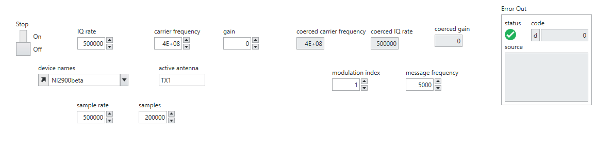
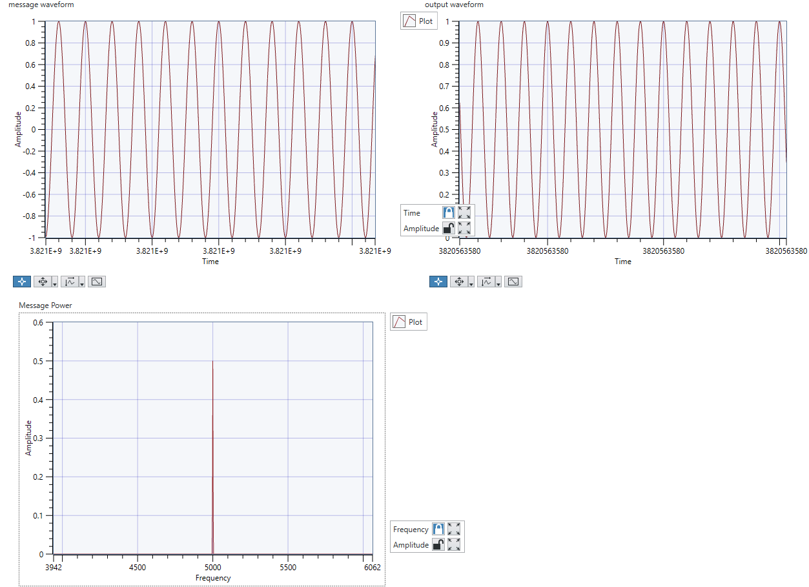

Similarly, the following output on the receiver:

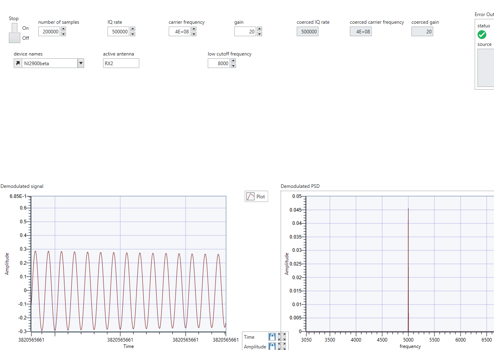

We observe that the demodulated signal on the receiver side has a peak at 5kHz, as expected. Note that the reason why the demodulated signal amplitude is lower than the message amplitude, and the reason why the demodulated signal amplitude is seen to fluctuate slightly, is simply because of factors like attenuation in the channel. For instance, if you cover the antenna with your hand, the amplitude will be changed accordingly.

### Effect of Noise

To observe the effect of noise, we first increase the receiver gain to `20dB`, which means that weaker noise signals will be amplified and detected in addition to the transmitted signal. Then, we gradually reduce the value of `modulation_index` and observe the effect on the output. The table of parameters is as follows:

| Param | Transmitter | Receiver |
|-------|-------------|----------|
| IQ Rate | 500k | 500k |
| Carrier Frequency | 400M | 400M |
| Gain | 0dB | 20dB |
| Sample Rate | 500k | N/A |
| Samples | 200k | 200k |
| LPF Cutoff Frequency | N/A | 1400Hz |
| Modulation Index | Varying | N/A |
| Message Frequency | 1000Hz | N/A |

For `mu = 1`, the transmitter output is as follows:


And the receiver demodulates the signal correctly, as follows:


Similarly with `mu = 0.9`:

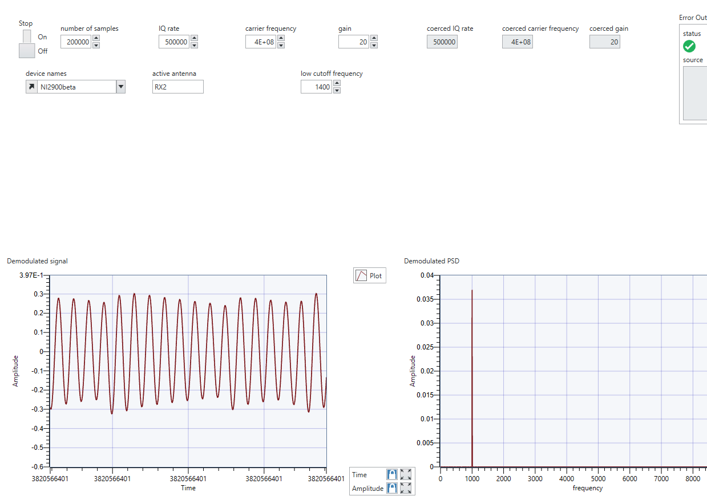

However at `mu = 0.8`, the effects of noise become apparent:


We see the effects of additive noise because the 20dB gain not only amplifies the signal but also amplifies the noise. Hence, we see that the PSD contains a peak at 1kHz, but now it also contains other peaks due to the effects of noise distorting the sinusoidal signal.

Similarly with `mu = 0.7`:


And with `mu = 0.2`:


Note: recall how the `USRP_TX_AM` circuit is constructed. It passes in the `modulation_index` as the ampitude of the message signal, adds 1 to it, and divides it by the maximum value. So e.g. for `mu = 1`, after we add 1 to the signal, the range of the signal is `[0, 2]`, and we divide each value by the maximum, hence scaling the waveform to the range `[0, 1]`. Whereas now consider `mu = 0.1`. After we add 1 to the signal, the range of the signal is `[0.9, 1.1]`, and thus when we divide by the maximum value of the array, we end up scaling the waveform to the range `[0.818, 1]`. This can be seen in the following transmitter output with `mu = 0.1`:


Generally speaking, with a smaller peak-peak amplitude of the signal, the greater the effect of noise. This is because the power of the message signal is smaller relative to the noise, thus the signal-noise ratio decreases.

## Exercise 4: Listening to AM Music

We want to detect a piece of AM-modulated music using the `USRP_AM_Rx_Music.gvi`. There are two parameters, `gain` and `digital signal gain`. `gain` is the amplifying factor applied to the raw signal, including both the message and the noise. Whereas for the `digital signal gain`, it is the multiplicative factor applied after the lowpass filter, hence after the high frequency noise is removed. Apart from this, the rest of the circuit is the same as `USRP_AM_Rx.gvi`. See above for the explanation for how it works.

Tuning the gain to 40 and the digital signal gain to 10, we obtain the following output:


We see peaks near 1kHz, 5kHz and around 100Hz. The music sounds a little like Fur Elise. However, it is hard to tell because there is a lot of noise due to interference. As all the students are all doing transmission during the lab sessions, all the transmissions are messing up with receiving the music, causing a lot of noise. Even running with constant parameters, the output will vary significantly, sometimes it will sound decent and sometimes it is just a lot of noise, depending on whether other students nearby are transmitting or not.

# Lab 3

## Exercise 1: FM Modulator

First see the below for some theory on FM:

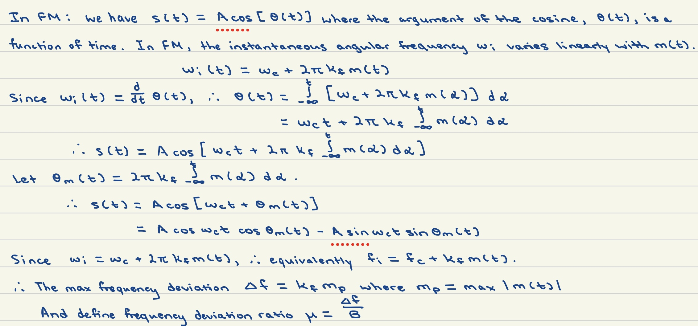

We construct the FM circuit as follows:


First, we use the wave generator to generate the message signal `m(t)`. Then, the next step is to perform integration to obtain `theta(t)`. The `Integral x(t)` function takes in the values in the array, as well as the `dt` argument. The `dt` argument is important because internally, the `Integral x(t)` function performs numerical integration by multiplying each value in the Y array by `dt` in order to approximate the area under the graph.

The output of the integral is then multiplied by `kf`, and then `2pi`, giving `theta(t)`. We then pass this through the `sine and cosine` function to obtain `sin(theta(t))` and `cos(theta(t))` and construct the waveforms back. We then use another wave generator to generate `Acos(wt)` and `Asin(wt)` where `A = carrier amplitude` and `w = carrier angular frequency`, and multiply them by `cos(theta(t))` and `sin(theta(t))` respectively. Finally we subtract them to obtain the FM output signal as derived above.

We then vary `kf` between 500, 2000, 5000 and observe how the output changes. For `kf = 500`:


The message frequency is 1kHz, hence the `message_psd` has a peak in the frequency spectrum at 1kHz, as expected. To understand the frequency spectrum of the modulated signal, we need to consider `Bessel functions of the first kind, c.f. Topics in EE - Signals and Communications, Prof Kin K. Leung`. Consider the following:


Basically, in FM, the modulated signal has an infinite bandwidth made up of one component at the carrier frequency `fc`, and an infinite number of sidebands at frequencies `fc + fm`, `fc - fm`, `fc + 2fm`, `fc - 2fm`, ... `fc + kfm` where `k` is an integer. The amplitudes of the sidebands are weighted by `J_n(beta)`, where `beta` is the modulation index a.k.a. the frequency deviation ratio. For `kf = 500` and `mp = 1`, we have `delta_f = kf * mp = 500`, and the bandwidth `B = 1000`, since the message frequency is 1. Hence, this gives `beta = delta_f / B = 0.5`. 

For FM, the number of significant sidebands is `beta + 1` because for `n > beta + 1` the amplitude of the Bessel function becomes negligible. Thus, only `n = 1` sideband is significant in this case. This agrees with the PSD screenshot above, where we have 2 significant sidebands at 9kHz and 11kHz, together with the center frequency at 10kHz.

Changing `kf = 2000`, we get the following:


Now, with `kf = 2000`, we have `delta_f = kf * mp = 2000 * 1 = 2000`. Hence, we have `beta = delta_f / B = 2`. Thus, the number of significant sidebands is `beta + 1 = 3`. As expected, we see that there are peaks at the center frequency 10kHz, as well as 3 significant sidebands at 11kHz, 12kHz, 13kHz, and another 3 sidebands mirrored at 9kHz, 8kHz, and 7kHz.

Finally with `kf = 5000`:


Now, with `kf = 5000`, we have `delta_f = kf * mp = 5000 * 1 = 5000`. Hence, we have `beta = delta_f / B = 5`. Thus, the number of significant sidebands is `beta + 1 = 6`. Hence, we see on the PSD that there are peaks at 10kHz, as well as 6 sidebands on each side separated at intervals of 1kHz. We see an additional 7th sideband, however the amplitude is very small. 

> Key takeaway: in FM, the modulated signal has theoretically an infinite bandwidth made up of one component at the carrier frequency fc, and an infinite number of sidebands at frequencies `fc +- n * fm`. However, for a fixed frequency deviation ratio beta, the amplitude of the bessel functions `J_n(beta)` decreases as n increases. As `n > beta + 1` the amplitude of the Bessel function becomes negligible. Thus the number of significant sidebands is `beta + 1`. Hence the bandwidth of FM signal is approximated using Carson's rule, where `B_fm = 2n * fm = 2(beta + 1) * fm = 2 * (delta_f + B)`.

## Exercise 2: FM Demodulator

FM Demodulation can be implemented using a differentiator, followed by an envelope detector. The output of the differentiator is an AM + FM modulated signal. Below is the mathematical theory of demodulation:


With reference to the notes above, this method involves the following steps:

1. Passing through a differentiator
2. Passing through a half-wave rectifier. Recall half-wave rectifier introduces a scaling of `1/pi`.
3. Passing through a low-pass filter
4. Subtracting DC component and scaling by `1/2Akf`

The demodulation circuit is implemented as follows:


First, we pass through FM signal through the `derivative x(t)` function. Internally, this computes the derivative using the equation `(x(t) - x(t - dt)) / dt`. Then, we use a `greater than or equal to 0` block to output a boolean array. For example, if the differentiator output is `[2, 3, -1, -3, 4]`, then the boolean array is `[true, true, false, false, true]`. Then, we convert the booleans into integers, so for this example `[1, 1, 0, 0, 1]`. Then, we multiply this integer array together with the differentiator output, so that the positive values are multiplied by 1 (hence stay unchanged), and the negative values are multiplied by 0, hence become 0.

The rest proceeds as usual. We reconstruct the waveform, pass it through a lowpass filter, subtract the dc component, then scale it by `1 / 2Akf`. See the handwritten notes above for the derivation.

## Exercise 3: FM Top Level Modulation and Demodulation

Now the next step is to create the top-level module where we combine both the modulator and demodulator. We create the following circuit:


We simply use an infinite loop with a stop button. On each iteration, we create the modulated signal with the parameters, pass it through the demodulator and plot both the original message signal and the final demodulated signal. We obtain the following output:

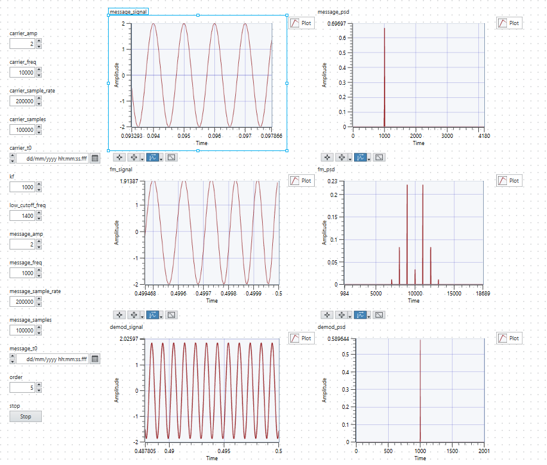

As we can see from the image, the demodulated signal's PSD has a peak at 1kHz, as well as an amplitude of 2, as expected, showing successful demodulation. However, when we zoom into the initial time, we can see an initial transient overshoot:


The reason for the transient is because at the very beginning when it receives the signal, the differentiator encounters a sudden change in signal values due to the initialization process, leading to an artificially high derivative. The amplitude also may not be exact since the derivative is computed using the finite difference method, i.e. `dt` is not infinitesimally small. We can tune the scaling parameter to obtain an amplitude of almost 2 for the demodulated signal:


## Exercise 4: FM Communication via USRP

First we analyze the provided file `FM-TxRx.gvi`. The `while` loop used to transmit the modulated signal is as follows:


The initial part of the circuit is largely the same as how we implemented it. It uses the `Wave Generator` to construct a sinusoidal wave with the desired characteristics, then it performs the integration, and multiplies it by `2 * pi * kf`, and then it passes through the `sin and cos` function. This is where it becomes different from our design. Going back to the handwritten notes on FM theory:


We see that `s(t)` can be written as `s(t) = A cos(w_c * t) * cos(theta(t)) - A sin(w_c * t) * sin(theta(t))`. Hence in our design, we perform the subtraction to output the real signal. However, `s(t)` can be interpreted in a different way. We can interpret `s(t) = s_I (t) cos(w_c * t) - s_Q(t) sin(w_c * t)`, in terms of its in-phase and quadrature components. Hence, comparing with the above equation, we see that the in phase and quadrature components are `A cos(theta(t))` and `A sin(theta(t))` respectively. Hence, the `FM-TxRx.gvi` design passes the cosine and sine outputs as the real and imaginary parts respectively, and then sends it to `niusrp write tx data` for transmission. It also takes the complex array, and uses the `build cluster` unit to merge the array back together with `dt` and `t0`, and plots the PSD.

Then, the RX loop is implemented as follows:


The RX demodulation circuit is based upon the following mathematical theory:


From the received complex array, it first extracts the real and imaginary parts corresponding to the I and Q components respectively. Note that these I and Q components have already been downconverted back to baseband (i.e. no longer centred at the carrier frequency) within the USRP. Then, we take the I component and we differentiate it, and multiply it with the Q component, giving expression (2) in the handwritten notes above. Hence, a lowpass filter extracts the DC term, and then it is scaled by `2pi * kf` to obtain the final demodulated signal.

Running the VI, we obtain the following results:


As expected, the demodulated signal has a peak at 1kHz in the frequency spectrum, corresponding to a single-tone sinusoidal message signal with frequency 1kHz. The amplitude of the demodulated signal is varying simply because of attenuation factors during the transmission.

## Exercise 4a: Carson's Rule

Again, refer to `Lab 3 Exercise 1` for the detailed explanations. As a quick recap:

1. FM modulated signal has a theoretically "infinite" bandwidth with a carrier at frequency `fc` and an infinite number of sidebands at `fc + fm`, `fc - fm`, `fc + 2fm`, `fc - 2fm` ... etc, i.e. at integer multiples of `fc +/- k * fm`.
2. The magnitude of each sideband is weighted by a Bessel function of the first kind `J_n(beta)`.
3. However for a fixed frequency deviation ratio beta, the amplitude of the Bessel function `J_n(beta)` decreases as n increases. 
4. For n > beta + 1, the amplitude of the Bessel function becomes negligible, hence the number of significant sidebands is approximately beta + 1.
5. Hence by Carson's rule, the approximate bandwidth of the FM signal is `2B(beta + 1)` where B is the bandwidth of the message signal. The alternative representation is `2(delta_f + B)`.

In Labview, the `FM Spectrum` graph shows the spectrum of the FM signal, except centred at 0 instead of fc, hence the positive frequencies correspond to the upper sideband and the negative frequencies correspond to the lower sideband. To view Carson's rule empirically, we set the message frequency at 1kHz, and view the FM spectrum for `delta_f = 1kHz, 5kHz, 30kHz`. 

Note that `delta_f = kf * mp` where `mp` is the maximum amplitude of the message signal. In this experiment, we set `mp` to be 1, such that `delta_f` is simply `kf`.

First, we see the result for `kf = 1000`:


In this case, `beta = delta_f / B = 1000/1000 = 1`. Hence, the number of significant sidebands is `beta + 1 = 1 + 1 = 2`. As expected, we see the center carrier, followed by 2 sidebands on each side. Thus, the total bandwidth is `2B (beta + 1) = 2 * 1000 * 2 = 4000 = 4kHz`, as can be seen on the graph, where the spectrum goes from -2000 to 2000.

Next, we see for `kf = 5000`. 


In this case, `beta = delta_f / B = 5000/1000 = 5`. Hence, the number of significant sidebands is `beta + 1 = 5 + 1 = 6`. As expected, we see the center carrier, followed by 6 sidebands on each side. Thus, the total bandwidth is `2B (beta + 1) = 2 * 1000 * 6 = 12000 = 12kHz`, as can be seen on the graph, where the spectrum goes from -6k to 6k. Additionally, we also see an additional 7th sideband, however the amplitude is very small and negligible. After all Carson's rule is just an approximation.

Finally with `kf = 30000`.


In this case, `beta = delta_f / B = 30000/1000 = 30`. Hence, the number of significant sidebands is `beta + 1 = 30 + 1 = 31`. As expected, we see the center carrier, followed by 31 sidebands on each side. Thus, the total bandwidth is `2B (beta + 1) = 2 * 1000 * 31 = 62000 = 62kHz`, as can be seen on the graph, where the spectrum goes from -31k to 31k. Also, we see a few additional (32nd, 33rd, 34th) sideband, going up to around 34kHz, but again this is just an approximation since there are theoretically an infinite number of sidebands.

TODO: go through Tx-Rx demodulation math again just to double confirm

## Exercise 5: Listening to FM Radio

First, we use `Find Radio Station.gvi` to obtain the PSD of frequencies around the carrier frequency. The circuit is as follows:


Basically, we set the carrier frequency and the IQ rate. This basically tunes the USRP receiver to receive all frequencies in a window centred at the carrier frequency. The bandwidth of this window is determined by the IQ rate. So for example, when we set carrier frequency to 90MHz and IQ rate to 20MHz, then the receiver will detect frequencies from 80MHz to 100MHz and filter out the rest. Essentially, the IQ rate sets the bandwidth around the carrier frequency.

Running the VI, we obtain the following output:

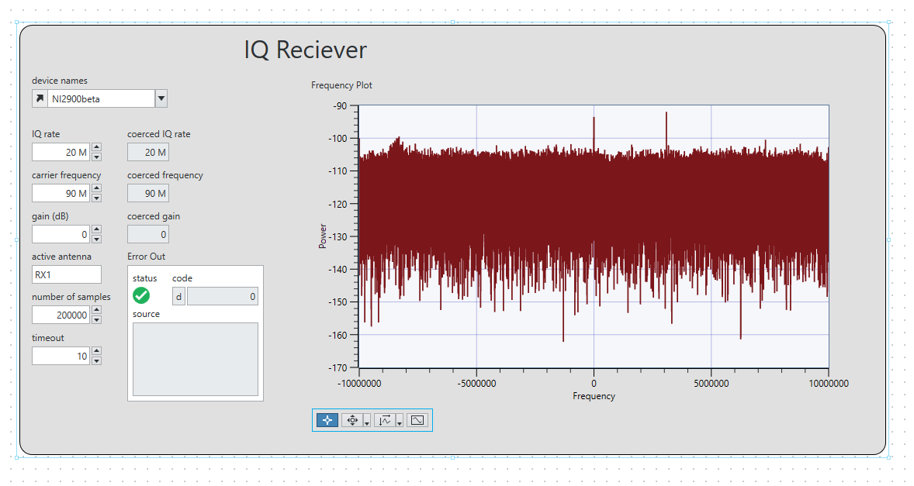

We see that there are two large peaks, one occurring at 0 and another one occurring to the right of it. Zooming in:


Indeed we see a peak at 0 corresponding to `90MHz - BBC Radio 2`. Similarly, zooming in to the other peak:


We see another peak at approximately just under 3.1MHz, corresponding to `93.1MHz - BBC Radio 4`.

Now that we have identified peaks in the frequency spectrum, we want to tune in to those frequencies to listen to FM radio. As per the instructions, we set the carrier frequency to **98.8MHz - BBC Radio 1**. We also set the IQ rate to 400kHz. The circuit is the same as before, just with a new module to play the signal:


We see two new modules, `Simple Resample` as well as `Simple Sound`. `Simple Resample` is as follows:


The coerced IQ rate and sample rate are passed as `Decimation` and `Interpolation` respectively. `Decimation` refers to how much the received signal is downsampled before passing it to Labview. Likewise, `Interpolation` is how much the signal is upsampled before transmission. The reason for this is because Labview might have a certain IQ rate, but the actual USRP FPGA hardware might be running at a different sampling rate. Hence, rational resample basically uses `Interpolation / Decimation` as the resampling factor, to ensure proper synchronization between Labview and the actual hardware. Then, `simple sound` just has a sound output configure block which plays the signal.

Additionally, we reduce the low cutoff frequency to 5kHz to reduce the amount of high frequency noise. By doing so, we are able to listen to the radio (albeit with some remaining static), and we see the following graph:


Additionally, we recorded an audio file of the music being played, which can be viewed at this link. The song being played on BBC Radio 1 at __5.38pm__ on __07/02/2025__ is `Rose's APT`. 

TODO: explain why 400kHz

TODO: add in link for audio recording

# Lab 4

## Exercise 1: BPSK Transmission

BPSK is optimum among binary modulation schemes in achieving the lowest average power for a given bit error ratio (BER), which is the ratio of transmitted bits which are incorrectly decoded at the receiver due to noise / interference. This is because BPSK has a constant envelope unlike ASK, hence is more robust to additive noise. Additionally, BPK has the maximum distance between symbols in the signal space, because BPSK has only two symbols, represented by the phase 0 and pi. BFSK requires more energy to achieve the same BER because BFSK symbols are not maximally-spaced in the signal space.

See below for a brief introduction to BPSK and pulse-shaping:


An RRC pulse shape is used. The RRC filter has a roll-off factor `beta`, which controls how much bandwidth is used beyond the minimum Nyquist bandwdth. Additionally, the RRC filter minimises ISI because instead of completely preventing time-domain overlap (which requires a rectangular pulse), the RRC pulse ensures that when summed over multiple pulses, the interference at the sampling points `nT` cancel out. 

According to the Nyquist ISI-free criterion, a pulse `p(t)` satisfies the Nyquist criterion if `p(nT) = 1 if n == 0 else 0`, which ensures that at sampling instants, only one symbol contributes, preventing ISI. The RC (raised cosine, not root-raised cosine) pulse satisfies the Nyquist criterion because its zero crossings align with adjacent symbol periods. However, instead of applying a full RC filter at one-end, an RRC filter can be used at both transmitter and receiver, because the convolution of two RRC filters results in an RC filter, ensuring ISI-free transmission. Note that a RCC filter at the receiver is also a matched filter which maximises SNR.

To build the BPSK transmitter, we first need the `MT Generate Bits` function which generates a random sequence of bits. Next, we just need to map the symbols to convert all 0 to -1, and keep bit 1s as is. We do this using the `for loop` as usual:


Then, we use the `AddFrameHeader` subVI. It basically inserts a 26-bit sequence to the beginning of the array. This is so that when the receiver receives the data, it can recognise the start of the transmission. This is used in conjunction with the `FrameSync` subVI which will look for the frame header, and cut off all bits before the frame header and including the frame header itself. 

Next, we need to upsample the symbols. We assume that the symbol rate is 10k and the IQ rate is 200k, giving an upsampling factor of 20. This means that the upsampler will add 19 zeros after each symbol, giving an IQ interval of T / 20 as required. It is necessary to sync the symbol rate to the USRP hardware's IQ rate in order to ensure proper digital-to-analog conversion. Note that a large upsampling factor of 20 is used (oversampling) so as to ensure that the Nyquist sampling criterion is met. 

After upsampling, we need to generate the pulse shape. We use the `MT Generate Filter Coefficients` function passing in the following parameters:

- Modulation type: PSK
- Pulse shaping Samples Per Symbol: 20
- Pulse shaping filter: Root raised cos

This basically creates the coefficients needed for the RRC filter. Next, we simply need to perform the convolution to obtain the output `b[n]p[t - n]`. We also use the `Quick Scale 1D` function which basically divides each value in the array by the max absolute value, hence scaling the array to the range [-1, 1]. Then, since the USRP device takes in a complex array, we use the `Real and Imaginary to Complex` block to convert the real array to a complex array, passing in 0 for the imaginary parts. Then, we build the waveform and wire the connections as appropriate to view the baseband PSD. 

Before transmission, we use the `Insert Pilots` function which prepends a specific sequence of symbols which is known to the receiver. Basically, USRP hardware may introduce frequency and phase offsets during transmission, and known pilot symbols helps the receiver to estimate and correct these offsets. These pilot symbols estimate the channel transfer function, so that on the receiver end, the `Channel Estimator` function can be used to adjust for the amplitude and phase error introduced by the channel. 

After inserting the pilots, we also add in another frame header to indicate the start reference point of the transmission. Finally, we connect it to the `USRP Write TX Data` function which performs the transmission. Hence, the final circuit is as follows:

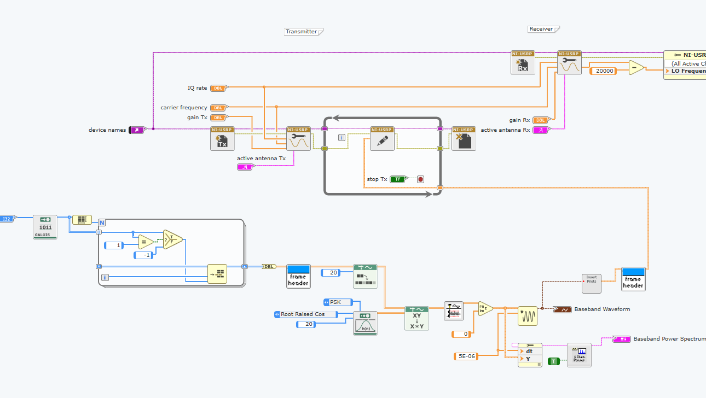

When running, we get the following output:


For purposes of comparison, we also visualize the output when no filtering is performed, i.e. the pulse signals are rectangle functions instead of RRC functions:


With rectangle functions, we see that in the time-domain, the signal is simply -1 and 1, i.e. a flat function with abrupt transitions. Whereas with RRC filtering, when we consider the time domain graphs, we can still see the distinct -1 and 1s, however the RRC performs smoothing such that there are no longer sharp transitions. Note that with RRC filtering, the pulses overlap, but due to the Nyquist property, they do not interfere at the sampling instants, hence still ensuring ISI-free transmission. 

Apart from the differences in the time domain, we also see obvious differences in the frequency domain. With rectangle pulses, we see that in the frequency domain, the main lobe has a bandwidth of approximately 10kHz (counting only positive frequencies), which is the same as the symbol rate. This is because the spectrum follows a sinc function, and the first null occurs at 1/T, which is precisely the symbol rate, 10kHz. 
Additionalluy, we also see that there are infinite side lobes. The reason for this is because rectangle pulses in the time domain correspond to sinc functions in the frequency domain, hence the frequency spectrum is sinc-shaped, and correspondingly we see multiple side bands and an infinite bandwidth, as explained at the beginning of this section.

This means that rectangle pulses result in distortion. Because there is an infinite number of side lobes, when the transmitted signal is passed through a band-limited filter, the sidelobes will be distorted / filtered, leading to interference between adjacent symbols in the time domain, and making it harder to accurate recover the transmitted bits.

Whereas with RRC filtering, apart from seeing a much faster rolloff, we also see that the bandwidth of the main lobe is smaller, at around 7500-8000Hz. This is because for an RRC filter, the bandwidth of the main lobe is approximately `symbol_rate * (1 + beta)`, where beta is the roll-off factor controlling the rolloff of the frequency spectrum. Hence, with RRC filtering, the sidebands are significantly attenuated, reducing inter-symbol interference and adjacent-channel interference.

## Exercise 2: BPSK Receiver

Recall that at the transmitter, the transmitted signal is `+-A * p(t) * cos(w_c t)`. At the receiving end, the received signal is `+-D * p(t) * cos(w_c t + phi)`, where D is a constant smaller than A, and phi is the phase difference between the local oscillators at the transmitter and receiver.

The USRP's receiver will internally multiply by a cosine to shift the signal from passband back to baseband, and output a train of output samples, `r[n] = +- D/2 p[n] e^jphi`. Note that given the `IQ Rate = 200k` and `Symbol rate = 10k`, this means that the `samples per symbol M = 20`.

There are a few steps in the receiver process:

1. Channel estimation: need to remove the phase difference caused by the channel itself, and the local oscillators. Previously, we have transmitted the pilots. Here, we need to make use of the pilots to correct the phase error. Hence, in the receiver, we first connect the output of `Fetch RX Data` and connect it into the `Frame Sync (complex)`, which identifies the header (start) of the transmission. Then, we use the `Channel Estimator` block which will read the received pilots and perform least-squares channel estimation to find the channel transfer function, and apply the inverse transfer function to the received signal to correct the phase error.
2. Next, we extract only the real components, and use the `Convolution` block to apply another RRC filter which acts as the receiver's **matched filter**. We pass in the `Matched samples per symbol` to 20, as calculated above. This matched filter is the optimal linear filter the maximises SNR in the presence of additive noise. Note also that the convolution of two RRC filters forms an RC filter which minimises ISI.
3. Next, we connect the output of the `Convolution` block to the input of `Pulse Align (Real)`, and similarly connect 20 samples per symbol. The reason for this is because the matched filter outputs an analog signal, and we need to sample it every `T` seconds, where `T` is the symbol interval, in order to re-extract the symbols. Because of filtering, propagation delays, and channel distortion, it is important to sample the signal at the correct timestamps, which coincide with the actual message bits. `Pulse Align` basically identifies which is the optimum **start index** to decimate from

```
How Pulse Align works is that, it will simply try all sampling possibilities to see which one gives the highest squared sums. So for example, suppose for illustration, the received signal has length 12, and samples per symbol M = 3. This means that in order to sample the bits, we either need to sample at indices [0, 3, 6, 9], [1, 4, 7, 10], or [2, 5, 8, 11]. What pulse align does is that it will use a for loop to try all 3 possibilities. For each sampling possibility, it will get the sum of squares of the elements. Then, it will take the one which has the highest squared sum. So e.g. if [2, 5, 8, 11] gives the highest squared sum, then Pulse Align will output the subarray starting from index 2, i.e. [2, 3, 4 ... 11]. Then, the output of Pulse Align is then passed into another Decimate block which performs the sampling to get [2, 5, 8, 11].
```

Once we have the real symbols, the next step is to add `Frame Sync (real)` to identify the start (header) of the real symbols. The receiver process is kind of like a reversal of the transmission process. Recall that for transmission, we added the frame header first, then performed upsampling. Here it is simply the reverse, to perform decimation (downsampling) first, followed by synchronizing with the frame header. 

Once we have identified the symbols (1 and -1), we just need to convert them into bits, where -1 -> 0 and 1 -> 1. To do this, we simply use a `For loop` to iterate over the received symbols. For each symbol, we simply check if it is greater than 0, then convert the booleans into integers 0 and 1, such that -1s will be mapped to 0 and the 1s will remain as 1.

Finally, we extract the subarray corresponding to the number of bits (message length), and calculate the BER. We can use the `MT Calculate BER`, or alternatively implement our own, as follows:


Basically, we pass in the two reference arrays (transmitted bits and received bits). We iterate over the values using a `For loop`. We initialise the number of bit errors to 0. Then, on each iteration, if the transmitted and received bit are not equal, that means there is a bit error, hence we increment the number of errors by 1. Finally, we divide it by the total number of bits to get the bit error ratio (proportion of bits wrongly decoded). We also compare it against a set threshold, such that the output `trigger` is high if the BER is below the input threshold.

Connecting everything together, we get the following circuit:


Running the transmission several times with different values of TX and RX gain, we get the following results. Some of the screenshots are shown:


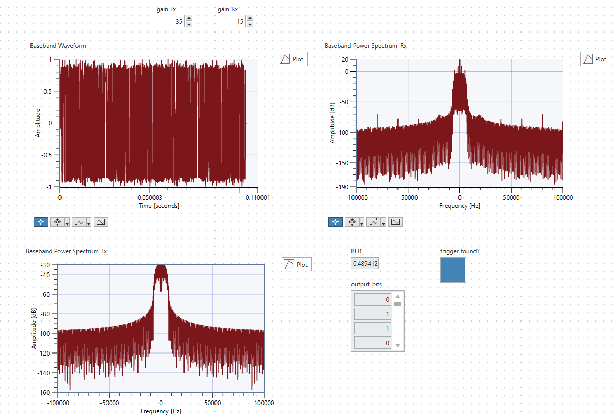

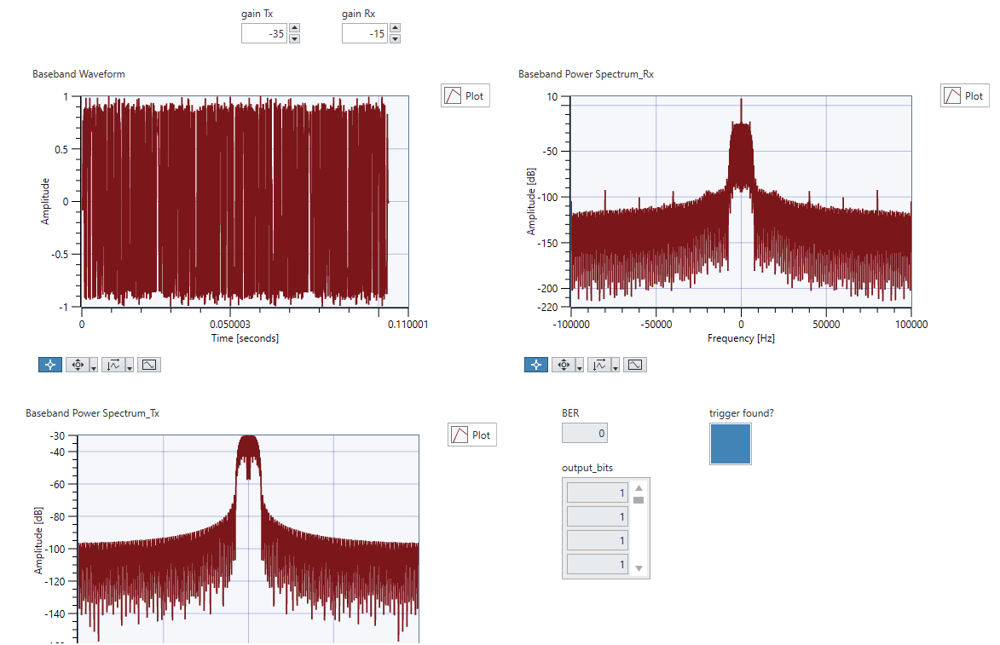


| TX Gain (dB) | RX Gain (dB) | BER_0 | BER_1 | BER_2 | BER_3 | BER_4 | BER_AVG |
|--------------|--------------|-------|-------|-------|-------|-------|---------|
| 0 | 0 | 0 | 0 | 0 | 0 |
| -35 | -15 | 0.012109 | 0.038345 | 0 | 0.025227 |
| -37 | -15 | 0.481602 | 0.482581 | 0.5 | 0.488061 |
| -40 | -15 | 0.515 | 0.086 | 0.473143 | 0.47545

-35, -15: 0.059716, 0.018218, 0.066459
-37, -15: 0.143004, 0.003083, 0.490816, 0.022199

TODO: check why a lot of variation, fill in the rest

## Exercise 3: DPSK

Suppose `a_n` are the source information symbols, and `b_n` are the encoded symbols. Refer to the following table:

| n | -1 | 0 | 1 | 2 | 3 | 4 | 5 | 6 | 7 |
|---|----|---|---|---|---|---|---|---|---|
| Information Symbols `a_n` | x | 1 | -1 | -1 | 1 | -1 | -1 | 1 | 1 |
| Encoded sequence `b_n` | 1 | 1 | -1 | 1 | 1 | -1 | 1 | 1 | 1 |
| LPF output (polarity) | x | + | - | - | + | - | - | + | + |

The formula for `b_n` is `b_n = b_n-1 * a_n`. So basically, if `a_n`, the information symbol in the current timestep, is equal to the symbol in the previous timestep, `b_n-1`, then the current encoded symbol will be 1, i.e. if they are both -1 or both 1, then `b_n` will be 1. Whereas if one of them is -1 and one of them is 1, then `b_n` will be -1. Hence, basically `b_n` is 1 if there is **no change from the previous symbol**, else -1 indicates that there is a change. `b_n` starts from 1 which is a reference symbol, because we need something to compare to. 

Then, the LPF outputs `+` if the symbol has the same sign as the previous symbol, i.e. `b_n = b_n-1`, else it outputs `-` if the current symbol `b_n` and the previous symbol `b_n-1` have opposite sign. 

Finally, we need to use the LPF output to make the decision. From the equation `b_n = b_n-1 * a_n`, we can rearrange it to get `a_n = b_n / b_n-1`. Since the LPF outputs `+` if `b_n = b_n-1`, that means that if the LPF output is `+`, then `a_n = 1`. Whereas if `b_n != b_n-1`, then the LPF outputs `-`, and `a_n = -1`. Thus, the decision can be made directly by reading the LPF output. 

TODO: add in all the explanations, circuits, graphs and all the other shit

## Exercise 4: Forward Error Correction (FEC)

We want to perform FEC by adding redundant information to the transmitted message. Basically, we send each bit 3 times, so e.g. for the original message `01`, the transmitted message becomes  `000111`. The decoder then decodes the bits 3 at a time. Since each original bit is now mapped to a group of 3 bits, and each of the 3 bits can potentially flip, the decoder can basically receive 8 possible triplets. It will decode them based on the majority bit, as follows:

| Triplet Received | Decision |
|------------------|----------|
| 000 | 0 |
| 001 | 0 |
| 010 | 0 |
| 011 | 1 |
| 100 | 0 |
| 101 | 1 |
| 110 | 1 |
| 111 | 1 |

This method of FEC will correct for one bit flip. Suppose the original bit is 0, and we send 000, and one bit flips to become 1, e.g. 001 or 010 or 100, the decoder will still decode it as a 0. This method however will not work if two bit flips, e.g. 000 becomes 011.

The first step to designing the FEC encoder is to triple each message bit from the `MT Generate Bits` block. We do this using the following simple sub-VI:


We just use a `For loop` to iterate the over the array. We set the input array to `auto index`, so that on each iteration, we access the values directly. Then, we use the `Build Array` function, and pass in the value 3 times, to create a subarray which is the bit duplicated 3 times. Then, we connect it to the output and set it to `Concatenate values`, so that all the subarrays will be concatenated together. This gives the following output, where `[0 1]` is converted to `[0 0 0 1 1 1 1 1 1]`.


We then connect the sub-VI in the main circuit as follows:


We simply take the output of the `MT Generate Bits`, pass in through our sub-VI to get the duplicated array, then pass it into the `For loop` which maps them from bits (0 and 1) to symbols (-1 and 1). Note that we also pass the updated array size (which is triple of the original) into the `Array Subset` function at the receiver. 

Next, at the receiver side, we need to design the decoder to decode the output of the `Array Subset` function using the majority-wins system as described above. We design the decoder as follows:


Basically, we pass the entire input-array (without auto-indexing) into a `For loop`. The `For loop` iterates over the length of the array, divided by 3. So for example, if the array has size 9 (corresponding to 3 groups of triplets), then the for loop will iterate 3 times, and the iteration number will be 0, 1, and 2.

Then, on each iteration, we take the iteration number `i`, triple it, and index the input array at `3i`, `3i + 1` and `3i + 2`. So using the example of a size-9 array, this means that:

- On the first iteration, `i = 0`, we index the array at `0, 1, 2`
- On the second iteration, `i = 1`, we index the array at `3, 4, 5`
- On the third iteration, `i = 2`, we index the array at `6, 7, 8`

Hence, on each iteration, we basically index the corresponding triplet, and we use the `Build Array` function to convert the 3 bits into a subarray of size 3, then use the `Boolean array to number` function to convert it into a number from `0-7`. 

Then, once we have the number `0-7`, we basically use it to index the truth table. We define an array `[0, 0, 0, 1, 0, 1, 1, 1]`, which is exactly the truth table described at the start of this section. Once we isolate the triplet, e.g. `011`, and convert it into a number `3`, we use this to index the truth array to get the decision. We then insert it into the shift register output.

We verify that our decoder works correctly as follows:


As we can see from above, each triplet maps to its correct output decision, as desired.

Finally, we integrate the decoder into our circuit as follows:


We also implement our own BER calculator as follows for full transparency:


Re-testing with the gain values used in task 2, we obtain the following results:

| TX Gain (dB) | RX Gain (dB) | BER_0 | BER_1 | BER_2 | BER_3 | BER_4 | BER_AVG |
|--------------|--------------|-------|-------|-------|-------|-------|---------|
| 0 | 0 |
| -35 | -15 |
| -37 | -15 |
| -40 | -15 | 0.244 | 0.165 | 0.124 | 0.1008 | 0.0838