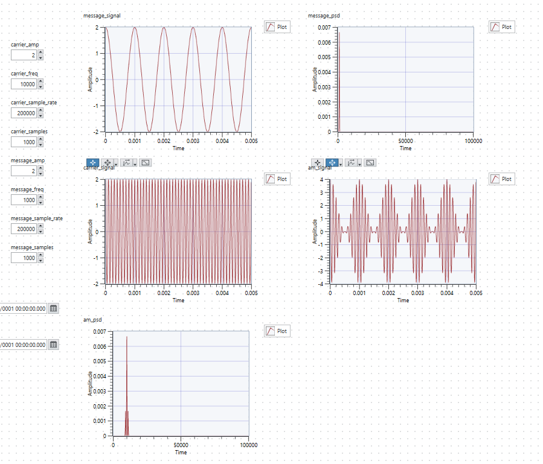
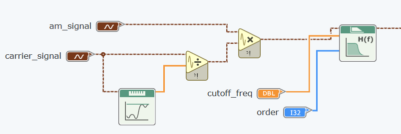
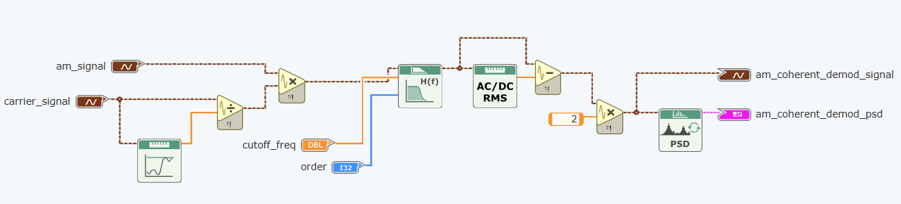

# Lab 1

## Exercise 1: Data Types in Labview

First, we create a `string to byte array` unit, which can take in a string as input, and output a byte array, where each element in the array is the ASCII value of each character in the input string.

In the `Panel` tab, we can input whatever value we want into the `string` input, and we can see the ASCII values in the corresponding unsigned byte array:

Next, we want to treat each ASCII value as a Fahrenheit temperature, and we want to convert them into Celsius values. We can perform this using the following block:

Because `C = (F - 32) * 5/9`, in order to multiply the array by a floating point number, we need to cast it to an array of doubles first. This is done using the `DBL` block, then the array is passed through operators which subtract 32 from the values and scale them by 5/9. **Note: it is important that the constants connected to the subtract / multiply blocks are of type `numerical constant`, to ensure that they are scalars, so that the simulator will perform the operation element-wise. Otherwise, if they are accidentally declared as 1d arrays, it will cause undesired behaviour.**

We can verify its functionality as follows:

Next, we use the `Add Array Elements` unit and the `Array Size` unit to get the sum and length of the output array respectively, and divide them to obtain the mean.

This gives the output as expected:

The last step is to compare the value of the mean against a constant threshold, set at 50. It then outputs 1 if the mean is greater than or equal to 50, else 0.

This gives the following outputs:

String `abcde` has mean 37.222, hence `is_hot` is false.

String `zzz` has mean 50. This is becaue `z` has ASCII value 122, hence in Fahrenheit, it is equivalent to `(122-32) * 5/9 = 50`. Hence, `is_hot` is true.

Using surname and first initial as input gives the ASCII values of the characters as follows:

The final schematic is as follows:

## Exercise 2: Visualisation of CLT

Brief overview: to generate a vector of i.i.d random numbers, evaluate their sample mean, and keep on repeating this in a while loop. On each iteration, update the histogram of sample means so that we can see the distribution of sample means.

We implement the block diagram as follows:

Explanation of block diagram: 

1. We have a while loop. We include a stop flag so that when executing the code, we can click on the flag to terminate execution of the while loop.
2. We have a `Wait` module which basically pauses execution for a fixed number of milliseconds between each iteration of the while loop
3. Inside the while loop, we create two nested for loops which are set to run 10 times each, hence 100 times in total.
4. Within the inner for loop, we insert a `Random Number` unit, and we connect the output of the random number generator to the `Add Array Elements` unit. The tunnels going through the frames of the for loops are set to `auto-index`. Essentially, this means that on each iteration of the loop, the newly-generated random number will be appended to an accumulating array of numbers.
5. We then insert a `Divide` unit, where we divide the running sum by the total number of iterations of the for loops, in this case 100. This is thus the sample mean.
6. We pass this sample mean into the `Insert Into Array` unit, and we pass in the `index` of the while loop as the insertion index. So on iteration 0, we will insert into index 0, then on iteration 1, we will insert into index 1 and so on.
7. We then connect the output array to the right frame of the `while` loop and change it to a `Shift Register`. The `Shift Register` tunnel on the left is then connected as the input array to insert into. Basically, the tunnel on the left carries data from the previous iteration, and the tunnel on the right carries data to the next iteration. This shift register is initialised to an array of zeros.
8. Finally, we add in a histogram unit so that the histogram can be viewed on each iteration.

Running this code, we get the following output. We see that the distribution of sample means looks approximately Gaussian.

Next, we want to modify the program such that it terminates automatically after 1000 iterations of the while loop. We can do this simply by using a `Greater or Equal` block to compare the index of the while loop with 1000. Once the index reaches 1000 (i.e. the while loop has run 1000 times), the `Greater or Equal` unit outputs true, and hence the while loop terminates.

We also reduce the number of bins, hence increasing the width of each bin. This gives the following result:

Finally, we want to standardize the distribution, i.e. make it have zero mean and unity standard deviation. We do this as follows:

Basically, we take the output of the `Insert into Array` block, which is the array of sample means. We pass this array of sample means into the `Statistics` module, which outputs the mean of the array, and the standard deviation of the array. We then take the array of sample means, subtract the calculated mean from the array (element-wise), and then divide the array by the calculated standard deviation (element-wise). Now that we have the processed array, we then plot this processed array using the `Histogram` function. Note that we still pass the raw array of sample means to the right `Shift Register` tunnel, so that the raw sample means can be carried over to the next iteration.

Hence, the final block diagram is as follows:

This gives the following output histogram after 1000 iterations. We can see that the distribution has 0 mean and unit variance, as required.

## Exercise 3: AM

First, we create two sine wave generators with the following parameters. Note that the phase angles are 90 degrees to that they become cosine waves.

| Characteristic | Message Signal | Carrier Signal |
|----------------|----------------|----------------|
| Frequency / Hz | 1k | 10k |
| Phase / deg | 90 | 90 |
| Sample rate | 200k | 200k |
| Samples | 1000 | 1000 |

We then insert the `FFT Power Spectrum and PSD` module to generate the PSD of the message signal. The PSD shows the distribution of power over the frequency spectrum.

We then insert graph modules to view the PSD graph, and the carrier and message signals, as follows:

Now we need to generate the full-AM signal. The full-AM signal is given by `s(t) = [A + m(t)]cos(wt)`, where `w` and `A` are the carrier angular frequency and carrier amplitude respectively. Hence, expanding, we have `s(t) = Acos(wt) + m(t)cos(wt) = c(t) + m(t)cos(wt)`, where `c(t)` is the carrier signal. Hence, to obtain the full-AM waveform, we first need to generate a new sinusoidal waveform with the carrier frequency and amplitude 1, i.e. `cos(wt)`, then multiply that with `m(t)`, and add the result together with `c(t)`.

We perform the above operations using the following block diagram:

We can see that the PSD of the full-AM waveform has peaks at 10Khz, as well as 9Khz and 11kHz. This is because the message signal `m(t)` has frequency 1kHz, and hence has peaks at `+-1kHz`. Since the carrier signal has frequency 10kHz, when multiplying by a cosine, the spectrum gets shifted by 10kHz, and hence peaks appear at 9kHz and 11kHz. Finally, we also add in the original carrier signal, since `s(t) = c(t) + m(t)cos(wt)`, and the addition of `c(t)` causes another peak at 10kHz.

We can then experiment with `mu = Am / Ac`, i.e. the ratio of the message amplitude to the carrier amplitude. In order to have a valid AM wave, we require mu to be between 0 and 1. This is because `s(t) = [A + m(t)]cos(wt)`, in other words, `[A + m(t)]` is acting as the envelope for `cos(wt)`, hence we must have `[A + m(t)] >= 0` for all t. When `mu < 1`, e.g. if Am = 0.5 and Ac = 1, then we can see that the envelope, `A + m(t)`, will be between 0.5 and 1.5, as follows:

If instead `mu > 1`, e.g. if Am = 1.5 and Ac = 1, we get the following:

This causes a reflection since the envelope becomes negative.

### Experimenting with Ac and Am

Recall `mu = Am / Ac`. In this section, `Ac` is set to be constant at 2. 

First, we want mu = 0.5, hence Am = 1. Recall `s(t) = [A + m(t)]cos(wt)`. Hence, with Ac = 2 and Am = 1, we expect the envelope to vary between 1 and 3, as follows:

Next, to achieve a mu value of 1, we need Ac = Am = 2. This means that the envelope will vary between 0 and 4, as follows:

Finally, we want a mu value of 1.5 (which is invalid for actual AM modulation). This means we need Am = 3. From `s(t) = [A + m(t)]cos(wt)`, this means that the envelope will vary between -1 and 5. This causes a problem because when the envelope `[A + m(t)]` is multiplied by the `cos(wt)`, multiplication by a negative value will cause inversion, hence the envelope will be reflected in the horizontal axis, as shown:

Hence, the impact of the modulation index of the modulated signal is that, when 0 < mu < 1, the envelope is always >= 0. If mu is exactly 1, then the envelope reaches 0, otherwise the envelope is always positive. However if mu is greater than 1, then there are instances where the envelope becomes negative, and multiplying the cosine carrier by a negative term will cause inversion, which is not valid. 

Again, as explained above, the PSD of the modulated signal has peaks at 10kHz, 9kHz and 11kHz. This is because `s(t) = [A + m(t)]cos(wt)`. `m(t)`, the carrier signal, has peaks in the frequency spectrum at 1kHz and -1kHz. When multiplying by a cosine with frequency 10kHz, it gets shifted by 10kHz, hence giving peaks at 9kHz and 11kHz. Finally, since `s(t) = m(t)cos(wt) + Acos(wt)`, the overall spectrum of the full-AM signal has another peak at 10kHz, due to the carrier signal `Acos(wt)`.

In the above graphs, since we keep Ac = 2, the size of the peak at 10kHz (due to `Acos(wt)`) is always the same. And as we increase the value of Am from 1 to 2 to 3, we see the height of the peaks at 9kHz and 11kHz increase.

### Experimenting with frequency

Now we set Ac = 1 and Am = 1, giving mu = 1. We want to vary the message frequency fm to be 1kHz, 2kHz, and 5kHz.

First, with fm = 1kHz, we get the following output:

The PSD has peaks at 10kHz, 9kHz and 11kHz, as explained above. Note that although Am and Ac are both 1, i.e. same amplitude, the reason why the peaks are smaller at 9kHz and 11kHz, compared to 10kHz, is because when multiplying by a cos(wt), the frequency spectrum gets shifted by `+w` and `-w`, and another effect is that the peaks are **scaled by a factor of 0.5**.

Next, we set fm = 2kHz:

We see two key differences:

1. Firstly, because the envelope is `[A + m(t)]`, since the frequency of `m(t)` is increased, hence the frequency of the envelope is increased.
2. Secondly, we see that the spectrum now has peaks at 10kHz, 8kHz and 12kHz. Again, the peak at 10kHz is due to addition of the carrier signal, `Acos(wt)`. Now, `m(t)` has peaks at 2kHz and -2kHz, hence when multiplied by a cosine of frequency 10kHz, i.e. `m(t)cos(wt)`, the spectrum of `m(t)` gets shifted by 10Khz, hence giving the peaks at 8kHz and 12kHz.

Finally, when changing fm to 5kHz, we see the above differences again:

1. Now, the envelope frequency is much higher. The same scale is used so that we can see the difference with fm = 2000 and fm = 1000.
2. Additionally, `m(t)` has peaks at 5kHz and -5kHz, hence when multiplied by a cosine of frequency 10kHz, these peaks get shifted to 5kHz and 15kHz respectively.

Also, one final note is that in the screenshots for the graphs, the graphs for the PSDs are plotted with amplitude against time, instead of amplitude against frequency. This is a trivial matter, because internally, LabView is actually plotting the amplitude against frequency, but when plotting out on the graph, by default it labels the horizontal axis as time instead of frequency. This is just a trivial matter of renaming the axis label from time to frequency.

# Lab 2

Overview: to build AM and FM communication simulators

## Exercise 1a: AM Demodulation (Coherent Demodulation)

Method: the transmitted signal is `s(t) = [A + m(t)]cos(wt)`. We multiply this signal by the carrier signal, `cos(wt)`, and then perform a lowpass filter. How this works is as follows:

Some things to note about this method:

1. In practice, this method is not very feasible because when we multiply `s(t)` by the carrier, the carrier `cos(wt)` at the receiver must be perfectly synchronized in frequency and phase as the transmitted carrier, which is difficult to achieve in practice.
2. The low-pass filter must have a cutoff frequency high enough to pass the bandwidth of `m(t)`, but low enough to block the components at `2wc`.

We first create the block to perform multiplication of the AM signal and the carrier signal:

The inputs `am_signal` and `carrier_signal` are of type `Waveform Array Terminal`, which we set `Change to Scalar`. Basically, these inputs store a single waveform, and each waveform contains three attributes

1. t0: the starting time of the waveform
2. dt: the sampling interval
3. Y: the array of sampled data points

The function `Change to Scalar` just means that each input stores a single waveform, whereas the default behaviour is that each input can store an array of waveforms.

The next step is to pass the multiplied signal, `e(t)`, through a low-pass filter. We use a **lowpass Butterworth filter**, as follows:

With reference to the screenshot of handwritten notes above, after LPF, the next step is to remove the DC component, then the final step is to scale the signal by factor 2. To remove the DC component, we use the `Amplitude Measurement` block and configure it to `AC DC and RMS` and `Single Shot` mode. Basically, this configuration instructs the module to calculate 3 values:

1. DC component: the mean value of the signal over the measurement window
2. AC component: the RMS value of the AC portion of the signal after subtracting the DC component
3. RMS: the overall RMS value which includes both the AC and DC components

Single Shot mode means that the module performs these calculations only once, i.e. no continuous updating, which is appropriate for our case. Again with reference to the screenshot of handwritten notes above, after removing the DC component, we just need to scale the wave by factor 2. Hence, the final block diagram is as follows:

To answer the 3 questions in the specified task, refer to the handwritten notes. In brief:

1. Why use a lowpass filter? To get rid of the high-frequency components at `2wc`
2. Why get rid of the DC component? Because after lowpass filtering, we have `0.5A + 0.5m(t)`
3. Why scale the message amplitude? Because after subtracting DC component, we are left with `0.5m(t)`, hence scale by factor 2.

## Exercise 1b: AM Demodulation (Envelope Detection)

This method involves a half-wave rectifier followed by an RC filter. In practice, the half-wave rectifier is typically implemented using a diode, which conducts during the positive cycles and is zero during the negative cycles:

The half-wave rectification using a diode scales the input signal by a factor of 1/pi. The reason for this is as follows:

The above explains why half-wave rectification introduces a scaling of 1/pi. Hence, before we do anything, we need to first multiply the signal by pi to account for this loss.

Again, the `am_signal` input is of type `Waveform Array Terminal`. As explained in `Exercise 1a`, the waveform array terminal has 3 attributes: `Y`, `dt` and `t0`. See section `Exercise 1a` for details. To implement the rectifier, we simply need to process the values in the `Y` array by leaving the positive values unchanged and setting the negative values to 0. Hence we use the `Waveform Properties` block to extract the 3 attributes of the amplified wave, `Y`, `dt` and `t0`, so that we can work on the `Y` array. Afterwards, we simply need to combine the modified `Y` array with the `t0` and `dt` to construct back the rectified waveform.

We perform the half-wave rectification using the following block:

- We create a `For loop`. The number of iterations of the for loop is the length of the array.
- We connect the array `Y` directly to the left-hand side of the `For loop`, and we set this boundary to `Auto Index`. This simply means that on each iteration of the for loop, we will access the next element in the array. So on iteration 0, we access Y[0], on iteration 1, we access Y[1] and so on. This allows us to easily access each element of the array in each iteration of the loop.
- We then use a `SELECT` block which basically acts as a 2-input multiplexer. We give it a condition, which is the boolean expression `Y[i] >= 0`. Hence, if the current element in the array is >= 0, the `SELECT` block will output the element, unchanged. Whereas if the current element is negative, the `SELECT` block will output 0.
- Once we have the output of the `SELECT` block, we pass it into the `INSERT INTO ARRAY` block, so that we can construct the updated array. This `INSERT INTO ARRAY` block works with a shift register (see Lab 1 Exercise 2 for details). Basically, the shift register is connected to the left and right-hand sides of the `For loop`. This passes the accumulating array into the next iteration. Note that on the left-hand side, we connect a constant array of 0s which simply means that we initialise it to 0.
- Once the `For loop` terminates, we can access the final output.

Refer to the below to show that the half-wave rectifier is working as expected. We initialise the `Y` array in the waveform to some random values `[1, 2, -3, -4]` for example purposes. We then pass this waveform through amplification by pi, and then the half-wave rectifier. As such, the output becomes `[pi, 2pi, 0, 0]` as expected.

Finally, we use the `Build Waveform` function to combine the modified `Y` array back together with the original `t0` and `dt` values. Then, with reference to the handwritten notes above, we need to use a lowpass filter to remove the terms of higher frequencies, and we need to subtract the DC component to get back the original `m(t)`. We do this using the same blocks as in `Exercise 1a`. Thus, the final block diagram is as follows:

